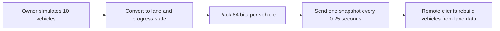

  <a href="./optimization.md">한국어</a> · <strong>English</strong> · <a href="./optimization.ja.md">日本語</a>

# Performance optimization

## Comparison basis

- The Profiler comparison uses the same 300-frame segment from the initial and latest snapshots
- The initial snapshot uses per-vehicle, per-frame execution; the latest uses a central manager and distributed sensors
- The test has ten active vehicles and 80 ClientSim remote players gathered at one point
- Frame, PlayerLoop, Udon, Physics, and GC figures are CPU measurements from Unity Profiler
- Per-second counts assume 60 FPS

## Result summary

| Unity Profiler metric | Initial snapshot | Latest snapshot | Change |
| --- | ---: | ---: | ---: |
| Average CPU frame time | 17.65 ms | **11.92 ms** | **32.5% lower** |
| CPU frame time P95 | 24.60 ms | **17.44 ms** | **29.1% lower** |
| Average PlayerLoop | 9.03 ms | **5.46 ms** | **39.5% lower** |
| Average Physics.Simulate | 0.49 ms | **0.17 ms** | **65.3% lower** |
| Average GC allocation per frame | 101.0 KB | **12.0 KB** | **88.1% lower** |
| Average Udon time | **0.82 ms** | 1.08 ms | 31.7% higher |

The latest snapshot includes centralized simulation, lane changes, state compression, and remote interpolation, increasing average Udon time from `0.82 ms to 1.08 ms`. Larger reductions in PlayerLoop, Physics, and GC lowered overall CPU frame time by 32.5%.

## 1. Per-vehicle work ran every frame

### Problem

The earlier `CarNavController` ran the following work on every active vehicle, every frame:

- Calculate direction and distance to the next waypoint
- Run `Physics.BoxCast` against vehicles, players, signals, and obstacles
- Calculate speed and rotation, then move the Transform
- Rotate the wheels
- Call `RequestSerialization()`

With 10 active vehicles at 60 FPS, driving decisions and BoxCast each ran 600 times per second. Different frame rates also changed the number of decisions and the resulting vehicle motion.

### Applied technique

Lane positions and connections are baked in the editor. A single `TrafficSimulationManager` now updates every vehicle.

- Driving decisions run at a fixed 0.1-second step
- Catch-up is capped at four steps per frame after a long frame
- Leading vehicles and traffic signals are checked through lane progress instead of physics queries
- Only the owner checks players and static obstacles with physics
- Sensor updates rotate through two active vehicles per frame

### Processing-frequency change

| Calculation | Before | Now | Change |
| --- | ---: | ---: | ---: |
| Vehicles checked per frame | 10 | 2 | **80% fewer** |
| Full check across 10 vehicles | Concentrated in one frame | Spread across 5 frames | Distributed load |

## 2. Network serialization was requested every frame

### Problem

The earlier code called `RequestSerialization()` every frame from each of the 10 vehicles. `CarSpawner` and the traffic signal did the same.

At 60 FPS:

- 10 vehicles: 600 calls/s
- Spawner: 60 calls/s
- Traffic signal: 60 calls/s
- Total: 720 calls/s

`720 calls/s` is the number of `RequestSerialization()` calls made by the code, not the number of packets VRChat transmitted. State and Transform synchronization were also split across vehicles, so ownership and send timing were managed by multiple objects.

### Applied technique

Instead of sending world position and rotation, the system sends each vehicle's position on shared lane data.

- One owner runs the simulation
- Two `int` arrays store up to 16 vehicle slots
- One 64-bit vehicle record contains activity, lane, progress, speed, acceleration, and lane-change state
- Sequence and ownership-generation values reject stale state
- No new request is queued while serialization is pending or the network is clogged
- The traffic signal shares the server time at which its cycle began, not a time value every frame

### Serialization-request change

The traffic manager creates a snapshot every 0.25 seconds and normally requests serialization four times per second. The signal sends only when initialized or when the master changes.

| Item | Before | Now | Change |
| --- | ---: | ---: | ---: |
| Serialization requests during steady operation | 720/s | 4/s | **99.4% lower** |

The state for 16 vehicles uses 128 bytes, with 12 bytes of shared values, for a total raw size of 140 bytes.

The implementation is in [`TrafficSimulationManager.cs`](../Assets/Shinjuku%20Udon/Traffic/TrafficSimulationManager.cs) and [`ShinhoTime.cs`](../Assets/Shinjuku%20Udon/Traffic/Shinho/ShinhoTime.cs).

## 3. Remote vehicles stepped between low-rate snapshots

### Problem

Sending only four snapshots per second reduces network work, but directly applying those snapshots makes remote vehicles jump every 0.25 seconds. Packet delays also make stopping and moving alternate visibly.

### Applied technique

- Keep the two latest snapshots and interpolate between them
- Adjust render delay between 0.35 and 1.25 seconds from packet arrival timing
- Predict for at most 0.15 seconds only after rendering passes the newest snapshot
- Reconstruct position and rotation together from lane progress
- Pack lane changes, emergency avoidance, and reverse recovery into the same 64-bit vehicle state

No additional synchronized data is required. Position and rotation are interpolated every rendered frame to prevent visible stepping.

## 4. Frame time spiked at a regular interval

### Problem

The initial system ran calculation and physics checks separately for every vehicle, causing recurring slow frames as player and vehicle counts increased. Profiler Timeline also showed full vehicle-sensor passes landing on the same frame.

### Applied technique

Signal stops now use baked stop-line calculations, and lane-change sensor bounds are precomputed per rule. Only the owner runs player physics checks, rotating through two vehicle sensors per frame. A pass over ten vehicles is spread across five frames instead of landing on one frame.

### Result

Between the initial and latest snapshots, CPU frame-time P95 fell from `24.60 ms to 17.44 ms`, a 29.1% reduction. Average CPU frame time also fell by 32.5%, improving both typical performance and recurring slow frames. Model, material, and render settings remained unchanged.

## 5. Model optimization that preserves Shinjuku's character

### Problem

Combining the environment into one mesh caused hidden areas to be rendered together, while splitting it too finely increased renderer and material submissions.

### Applied settings and figures

| Item | Current setting |
| --- | ---: |
| Environment model | 246,921 triangles, 240 meshes |
| Materials | 77 materials, 313 renderer material slots |
| Static-batching targets | 392 objects |
| Occluders | 330 objects |
| Occlusion data | 3.28 MB |
| Meshes using baked lighting | Approximately 220 |
| Lightmaps | Three 4096 maps + one 512 map |
| Environment mesh colliders | 2 |
| Blend shapes | 41 across 4 meshes, 2,624 triangles |

- Split buildings and street objects into spatial sections and apply occlusion culling
- Apply static batching to 392 static objects
- Apply Bakery baked lighting to approximately 220 meshes
- Disable shadow receiving on 264 renderers that do not need it
- Disable motion vectors on 247 static renderers
- Disable mesh Read/Write; enable vertex welding and lightmap UV generation
- Disable automatic colliders for the full model and keep only two movement meshes

## Related production tools

| Tool | Problem addressed | Code |
| --- | --- | --- |
| Lane-data baking | Avoid runtime lane discovery and catch broken links before a build | [`TrafficLaneBakerEditor.cs`](../Assets/Shinjuku%20Udon/Traffic/Editor/TrafficLaneBakerEditor.cs) |
| Vehicle and sensor visualization | Inspect sensor ranges, current lanes, target lanes, and network state in the Scene view | [`TrafficSimulationManagerEditor.cs`](../Assets/Shinjuku%20Udon/Traffic/Editor/TrafficSimulationManagerEditor.cs) |
| 80-player stress test | Reproduce periodic frame drops under the same layouts and mark each measurement range | [`TrafficPlayerStressTestEditor.cs`](../Assets/Editor/TrafficPlayerStressTestEditor.cs) |

[Back to the README](../README.en.md)
