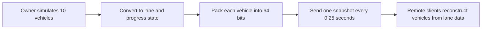

  <a href="./optimization.md">한국어</a> · <a href="./optimization.ja.md">日本語</a> · <strong>English</strong>

# Traffic system performance optimization

## Test environment and comparison method

| Item | Condition |
| --- | --- |
| Hardware | Intel Core i5-13400F · NVIDIA GeForce RTX 3080 Ti 12GB · 32GB RAM |
| Software | Unity `2022.3.22f1` · VRChat SDK - Worlds `3.8.1` |
| Runtime | Unity Editor Play Mode · ClientSim · no PC build or VRChat Build & Test capture |
| Load | Ten active vehicles · 80 ClientSim remote players concentrated at the same location |
| Comparison | Initial: per-vehicle work every frame · Latest: central manager with staggered sensor checks |
| Capture window | 300 frames from each of the initial and latest snapshots |
| Aggregation | Arithmetic mean and P95 of per-frame samples · per-second counts assume 60 FPS |
| Profiler metrics | CPU frame time · PlayerLoop · Udon · Physics.Simulate · GC Alloc |

The original capture record does not preserve the Deep Profile setting, a separate warm-up duration, or the number of repeated runs. The initial implementation is a local snapshot from before the public repository was created, so there is no matching commit hash. The current implementation appears in the first public source commit, [`e212623`](https://github.com/hjcud/Shinjuku-Live-Street/commit/e212623), but the table compares two local snapshots rather than two repository commits.

> [!NOTE]
> These results compare the effect of the architecture change on the same PC under matching Editor conditions. ClientSim does not fully reproduce live networking or user behavior, so the figures should not be treated as live VRChat instance or build performance. GPU frame time and memory usage were not measured.

## Reproducibility tool provided today

[`TrafficPlayerStressTestEditor.cs`](../Assets/Editor/TrafficPlayerStressTestEditor.cs) did not produce the 300-frame results above. It is an Editor-only stress test added later to make future captures repeatable.

- Runs `WAIT`, `DIST`, and `CROWD` for 600 frames each
- Marks the first 60 frames after each transition as warm-up and the remaining 540 frames as the measurement window
- Repeats the three-state cycle three times, producing nine measurement windows
- Uses custom Profiler markers to identify the state and warm-up or measurement phase
- Writes the Unity-to-Profiler frame mapping to `Temp/TrafficPlayerStressPhases.csv` on every run

Future published results should use matching build and Profiler settings and state how the three cycles are aggregated, such as by median or mean.

## Results

| Unity Profiler metric | Initial snapshot | Latest snapshot | Change |
| --- | ---: | ---: | ---: |
| Average CPU frame time | 17.65 ms | **11.92 ms** | **32.5% lower** |
| CPU frame time P95 | 24.60 ms | **17.44 ms** | **29.1% lower** |
| Average PlayerLoop | 9.03 ms | **5.46 ms** | **39.5% lower** |
| Average Physics.Simulate | 0.49 ms | **0.17 ms** | **65.3% lower** |
| Average GC allocation per frame | 101.0 KB | **12.0 KB** | **88.1% lower** |
| Average Udon time | **0.82 ms** | 1.08 ms | 31.7% higher |

The latest snapshot includes centralized simulation, lane changes, state compression, and remote interpolation, increasing average Udon time from `0.82 ms to 1.08 ms`. Larger reductions in PlayerLoop, Physics, and GC lowered overall CPU frame time by 32.5%.

## 1. Every vehicle ran its own workload every frame

### Problem

In the earlier system, each active vehicle's `CarNavController` performed the following operations every frame:

- Calculate direction and distance to the next waypoint
- Run `Physics.BoxCast` to detect vehicles, players, signals, and obstacles
- Update speed and rotation, then move the Transform
- Rotate the wheels
- Call `RequestSerialization()`

With 10 active vehicles at 60 FPS, driving decisions and BoxCast were each performed 600 times per second. Different frame rates also changed the number of decisions and the resulting vehicle motion.

### Solution

Lane positions and connections are baked in the editor. A single `TrafficSimulationManager` now updates every vehicle.

- Driving decisions run at a fixed 0.1-second step
- Catch-up is capped at four steps per frame after a long frame
- Vehicles ahead and traffic signals are checked through lane progress instead of physics queries
- Only the owner checks players and static obstacles with physics
- Sensor checks are staggered across two active vehicles per frame

### Sensor workload

| Calculation | Before | Now | Change |
| --- | ---: | ---: | ---: |
| Vehicles checked per frame | 10 | 2 | **80% fewer** |
| Full check across 10 vehicles | Concentrated in one frame | Spread across 5 frames | Distributed load |

## 2. Every vehicle requested network serialization every frame

### Problem

The earlier code called `RequestSerialization()` every frame from each of the 10 vehicles. `CarSpawner` and the traffic signal did the same.

At 60 FPS:

- 10 vehicles: 600 calls/s
- Spawner: 60 calls/s
- Traffic signal: 60 calls/s
- Total: 720 calls/s

`720 calls/s` is the number of `RequestSerialization()` calls issued by the code, not the number of packets transmitted by VRChat. State and Transform synchronization were also split across vehicles, so ownership and transmission timing were managed by multiple objects.

### Solution

Instead of sending world position and rotation, the system sends each vehicle's progress along shared lane data.

- One owner runs the simulation
- Two `int` arrays store up to 16 vehicle slots
- One 64-bit vehicle record contains activity, lane, progress, speed, acceleration, and lane-change state
- Sequence and ownership-generation values reject stale state
- No new request is queued while serialization is pending or the network is congested
- The traffic signal shares the server timestamp for the start of its cycle instead of sending a time value every frame

### Serialization requests

The traffic manager creates a snapshot every 0.25 seconds and normally requests serialization four times per second. The signal sends only when initialized or when the master changes.

| Item | Before | Now | Change |
| --- | ---: | ---: | ---: |
| Serialization requests during steady operation | 720/s | 4/s | **99.4% lower** |

The state for 16 vehicles uses 128 bytes, plus 12 bytes of shared metadata, for a total raw size of 140 bytes.

The implementation is in [`TrafficSimulationManager.cs`](../Assets/Shinjuku%20Udon/Traffic/TrafficSimulationManager.cs) and [`ShinhoTime.cs`](../Assets/Shinjuku%20Udon/Traffic/Shinho/ShinhoTime.cs).

## 3. Remote vehicles appeared to jump between snapshots

### Problem

Sending only four snapshots per second reduces network overhead, but applying each snapshot directly makes remote vehicles jump every 0.25 seconds. Packet delays can also cause visible start-stop motion.

### Solution

- Keep the two latest snapshots and interpolate between them
- Adjust interpolation delay between 0.35 and 1.25 seconds based on packet arrival timing
- Extrapolate for no more than 0.15 seconds when render time passes the newest snapshot
- Reconstruct position and rotation together from lane progress
- Pack lane changes, emergency avoidance, and reverse recovery into the same 64-bit vehicle state

No additional synchronized data is required. Position and rotation are interpolated every rendered frame to prevent visible stepping.

## 4. Frame time spiked at regular intervals

### Problem

The initial system ran calculations and physics checks separately for every vehicle, causing recurring slow frames as player and vehicle counts increased. The Profiler Timeline also showed full vehicle-sensor passes coinciding on a single frame.

### Solution

Traffic-light stopping now uses baked stop-line data, and lane-change sensor bounds are precomputed for each rule. Only the owner runs player physics checks, processing two vehicle sensors per frame in sequence. A pass over ten vehicles is spread across five frames instead of landing on a single frame.

### Result

Between the initial and latest snapshots, CPU frame-time P95 fell from `24.60 ms to 17.44 ms`, a 29.1% reduction. Average CPU frame time also fell by 32.5%, improving both typical performance and recurring slow frames. Model, material, and render settings remained unchanged.

## Supporting editor tools

| Tool | Problem addressed | Code |
| --- | --- | --- |
| Lane-data baking | Avoid runtime lane discovery and catch broken links before a build | [`TrafficLaneBakerEditor.cs`](../Assets/Shinjuku%20Udon/Traffic/Editor/TrafficLaneBakerEditor.cs) |
| Vehicle and sensor visualization | Inspect sensor ranges, current lanes, target lanes, and network state in the Scene view | [`TrafficSimulationManagerEditor.cs`](../Assets/Shinjuku%20Udon/Traffic/Editor/TrafficSimulationManagerEditor.cs) |
| 80-player stress test | Reproduce periodic frame drops with a consistent layout and mark each capture range | [`TrafficPlayerStressTestEditor.cs`](../Assets/Editor/TrafficPlayerStressTestEditor.cs) |

[Back to the README](../README.en.md)
