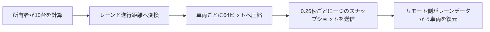

  <a href="./optimization.md">한국어</a> · <a href="./optimization.en.md">English</a> · <strong>日本語</strong>

# パフォーマンス最適化

## 比較条件

- Profiler比較には、初期スナップショットと最新スナップショットの同じ300フレームを使用
- 初期スナップショットは車両ごとの毎フレーム処理、最新スナップショットは中央管理と分散センサーを使う構成
- 稼働車両10台とClientSimのリモートプレイヤー80人を1地点に集めた状態
- フレーム、PlayerLoop、Udon、Physics、GCはUnity ProfilerのCPU測定値
- 1秒あたりの実行回数は60 FPSとして計算

## 結果の概要

| Unity Profiler項目 | 初期スナップショット | 最新スナップショット | 変化 |
| --- | ---: | ---: | ---: |
| 平均CPUフレーム時間 | 17.65 ms | **11.92 ms** | **32.5%削減** |
| CPUフレーム時間 P95 | 24.60 ms | **17.44 ms** | **29.1%削減** |
| PlayerLoop平均 | 9.03 ms | **5.46 ms** | **39.5%削減** |
| Physics.Simulate平均 | 0.49 ms | **0.17 ms** | **65.3%削減** |
| 1フレームのGC割り当て平均 | 101.0 KB | **12.0 KB** | **88.1%削減** |
| Udon平均 | **0.82 ms** | 1.08 ms | 31.7%増加 |

最新スナップショットには中央シミュレーション、車線変更、状態圧縮、リモート補間が含まれるため、Udon平均は`0.82 ms → 1.08 ms`に増えました。PlayerLoop、Physics、GCがそれ以上に減り、CPUフレーム時間全体は32.5%短縮しています。

## 1. 各車両が毎フレーム計算していた問題

### 問題

旧`CarNavController`は、稼働中の全車両で毎フレーム次の処理を行っていました。

- 次のWaypointまでの方向と距離を計算
- `Physics.BoxCast`で前方の車両、プレイヤー、信号、障害物を判定
- 速度と回転を計算してTransformを移動
- 車輪を回転
- `RequestSerialization()`を呼び出し

稼働車両10台、60 FPSでは、走行判断とBoxCastがそれぞれ毎秒600回実行されます。フレームレートが変わると、判断回数と車両の移動結果も変わっていました。

### 適用した技術

レーンの位置と接続関係をエディタで事前生成し、`TrafficSimulationManager`一つで全車両を計算する構成へ変更しました。

- 走行判断を0.1秒の固定間隔で実行
- 長いフレームの後も1フレームの補正計算を最大4回に制限
- 前方車両と信号は物理判定ではなくレーン上の進行距離で計算
- プレイヤーと固定障害物の物理判定は所有者だけが実行
- 稼働車両を順番に、1フレーム2台ずつセンサー更新

### 処理回数の変化

| 計算 | 変更前 | 現在 | 変化 |
| --- | ---: | ---: | ---: |
| 1フレームで判定する車両 | 10台 | 2台 | **80%削減** |
| 車両10台すべての判定 | 1フレームに集中 | 5フレームに分散 | 負荷を分散 |

## 2. 毎フレーム送信を要求していた問題

### 問題

旧コードでは車両10台がそれぞれ毎フレーム`RequestSerialization()`を呼び出していました。`CarSpawner`と信号機も同じ方法でした。

60 FPSで計算すると次の通りです。

- 車両10台: 毎秒600回
- スポナー: 毎秒60回
- 信号機: 毎秒60回
- 合計: 毎秒720回

`720回/秒`は実際のパケット数ではなく、コードが`RequestSerialization()`を呼び出した回数です。状態とTransformの同期も車両ごとに分かれ、送信タイミングと所有権を複数のオブジェクトで管理していました。

### 適用した技術

車両のワールド座標と回転を送る代わりに、全員が共有するレーン上の状態を送ります。

- 所有者一人だけがシミュレーションを実行
- 二つの`int`配列へ最大16台の状態を保存
- 車両1台の64ビットに稼働状態、レーン、進行距離、速度、加速度、車線変更状態を記録
- 連番と所有権の世代番号で古い状態を除外
- 直列化中またはネットワーク混雑時は新しい要求を積まない
- 信号機は毎フレームの時刻ではなく、周期を開始したサーバー時刻を共有

### 送信要求の変化

交通管理スクリプトは0.25秒ごとにスナップショットを作り、通常は毎秒4回の直列化を要求します。信号機は初期化時とマスター変更時だけ送信します。

| 項目 | 変更前 | 現在 | 変化 |
| --- | ---: | ---: | ---: |
| 通常実行中の直列化要求 | 720回/秒 | 4回/秒 | **99.4%削減** |

車両16台の状態に128バイト、共通値に12バイトを使い、生データを合計140バイトにまとめました。

実装は[`TrafficSimulationManager.cs`](../Assets/Shinjuku%20Udon/Traffic/TrafficSimulationManager.cs)と[`ShinhoTime.cs`](../Assets/Shinjuku%20Udon/Traffic/Shinho/ShinhoTime.cs)で確認できます。

## 3. 低い送信頻度でリモート車両が途切れて見える問題

### 問題

送信を毎秒4回まで下げても、受信した状態をそのまま適用すると、リモート車両は0.25秒ごとに位置が切り替わって見えます。パケットが遅れた場合は停止と移動を繰り返します。

### 適用した技術

- 直近二つのスナップショットを保持して補間
- パケットの到着間隔に合わせ、表示遅延を0.35～1.25秒の範囲で調整
- 最新スナップショットを越えた場合だけ最大0.15秒先まで予測
- レーン進行距離から位置と回転を一緒に復元
- 車線変更・緊急回避・後退復帰まで車両1台あたり64ビットに圧縮

同期データを増やさず、位置と回転を毎フレーム補間して画面上の途切れを抑えました。

## 4. 一定間隔でフレーム時間が跳ね上がる問題

### 問題

初期システムでは車両ごとに計算と物理判定を個別に実行していたため、プレイヤーと車両が増えると遅いフレームが繰り返し発生しました。Profiler Timelineでは、全車両のセンサー判定が同じフレームに集中する区間も確認できました。

### 適用した技術

信号停止はベイク済み停止線の計算へ分離し、車線変更の感知範囲はルールごとに事前計算しました。プレイヤーの物理判定は所有者だけが実行し、車両センサーを1フレーム2台ずつ更新します。車両10台の一巡を5フレームに分散し、1フレームへの集中を防いでいます。

### 結果

初期スナップショットと最新スナップショットを比較すると、CPUフレーム時間のP95は`24.60 ms → 17.44 ms`となり、29.1%減少しました。平均CPUフレーム時間も32.5%減少し、通常時の性能と繰り返し発生する遅いフレームの両方が改善しています。モデル、マテリアル、レンダリング設定はそのまま維持しました。

## 5. 新宿らしさを残すモデル最適化

### 問題

環境モデルを一つにまとめると隠れた範囲まで描画され、細かく分けすぎるとレンダラーとマテリアルの呼び出しが増える問題がありました。

### 適用した設定と数値

| 項目 | 現在の設定 |
| --- | ---: |
| 環境モデル | 246,921三角形、240メッシュ |
| マテリアル | 77個、レンダラーマテリアルスロット313個 |
| スタティックバッチング対象 | 392オブジェクト |
| オクルーダー | 330オブジェクト |
| オクルージョンデータ | 3.28 MB |
| ベイク照明を適用したメッシュ | 約220 |
| ライトマップ | 4096を3枚 + 512を1枚 |
| 環境用Mesh Collider | 2個 |
| ブレンドシェイプ | 4メッシュに41個、2,624三角形 |

- 建物と街路を区域ごとに分割し、オクルージョンカリングを適用
- 静的オブジェクト392個にスタティックバッチングを適用
- 約220メッシュにBakeryのベイク照明を適用
- 不要なレンダラー264個で影の受信を無効化
- 静的レンダラー247個でモーションベクターを無効化
- Mesh Read/Writeを無効化し、頂点結合とライトマップUV生成を有効化
- モデル全体の自動コライダーを無効化し、移動に必要な2メッシュだけを使用

## 関連する制作ツール

| ツール | 解決した問題 | コード |
| --- | --- | --- |
| レーンデータのベイク | 実行中のレーン探索を減らし、切れた接続をビルド前に確認 | [`TrafficLaneBakerEditor.cs`](../Assets/Shinjuku%20Udon/Traffic/Editor/TrafficLaneBakerEditor.cs) |
| 車両・センサーの表示 | センサー範囲、現在レーン、目標レーン、ネットワーク状態をScene Viewで確認 | [`TrafficSimulationManagerEditor.cs`](../Assets/Shinjuku%20Udon/Traffic/Editor/TrafficSimulationManagerEditor.cs) |
| 80人負荷テスト | 一定間隔のフレームドロップを同じ配置で再現し、測定区間を記録 | [`TrafficPlayerStressTestEditor.cs`](../Assets/Editor/TrafficPlayerStressTestEditor.cs) |

[READMEへ戻る](../README.ja.md)
