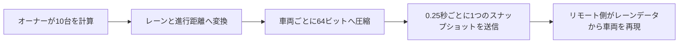

  <a href="./optimization.md">한국어</a> · <a href="./optimization.en.md">English</a> · <strong>日本語</strong>

# パフォーマンス最適化

## 比較条件

- Profilerの比較には、同一条件で記録した初期・最新スナップショットの300フレームずつを使用
- 初期スナップショットは車両ごとの毎フレーム処理、最新スナップショットは中央管理とセンサー判定の分散を取り入れた構成
- 稼働車両10台とClientSimのリモートプレイヤー80人を同じエリアに集めた状態
- CPUフレーム時間、PlayerLoop、Udon、Physics、GCはUnity Profilerで取得したCPU測定値
- 1秒あたりの実行回数は60 FPSを前提に計算

## 結果の概要

| Unity Profiler項目 | 初期スナップショット | 最新スナップショット | 変化 |
| --- | ---: | ---: | ---: |
| 平均CPUフレーム時間 | 17.65 ms | **11.92 ms** | **32.5%削減** |
| CPUフレーム時間 P95 | 24.60 ms | **17.44 ms** | **29.1%削減** |
| PlayerLoop平均 | 9.03 ms | **5.46 ms** | **39.5%削減** |
| Physics.Simulate平均 | 0.49 ms | **0.17 ms** | **65.3%削減** |
| 1フレームあたりのGC割り当て | 101.0 KB | **12.0 KB** | **88.1%削減** |
| Udon平均 | **0.82 ms** | 1.08 ms | 31.7%増加 |

最新スナップショットには中央シミュレーション、車線変更、状態圧縮、リモート補間が含まれるため、Udon平均は`0.82 ms → 1.08 ms`に増えました。一方でPlayerLoop、Physics、GCは大きく減少し、CPUフレーム時間全体は32.5%短縮しています。

## 1. 各車両が毎フレーム計算していた問題

### 問題

旧`CarNavController`は、稼働中の各車両で毎フレーム次の処理を行っていました。

- 次のウェイポイントまでの方向と距離を計算
- `Physics.BoxCast`で前方の車両、プレイヤー、信号、障害物を検出
- 速度と回転を計算してTransformを更新
- 車輪を回転
- `RequestSerialization()`を呼び出し

稼働車両10台、60 FPSでは、走行判断とBoxCastがそれぞれ毎秒600回実行されます。フレームレートが変わると、判断回数と車両の移動結果も変わっていました。

### 改善内容

レーンの位置と接続関係をエディターで事前生成し、1つの`TrafficSimulationManager`で全車両を計算する構成へ変更しました。

- 走行判断を0.1秒の固定間隔で実行
- 処理落ち後の追いつき計算は、1フレームあたり最大4ステップに制限
- 前方車両と信号は、物理判定ではなくレーン上の進行距離で判定
- プレイヤーと固定障害物の物理判定はオーナーだけが実行
- センサー判定は稼働車両を順番に、1フレームあたり2台ずつ更新

### 処理回数の変化

| 計算 | 変更前 | 現在 | 変化 |
| --- | ---: | ---: | ---: |
| 1フレームで判定する車両 | 10台 | 2台 | **80%削減** |
| 車両10台すべての判定 | 1フレームに集中 | 5フレームに分散 | 負荷を分散 |

## 2. 各車両が毎フレーム同期を要求していた問題

### 問題

旧コードでは車両10台がそれぞれ毎フレーム`RequestSerialization()`を呼び出していました。`CarSpawner`と信号機も同様に毎フレーム呼び出していました。

60 FPSで計算すると次の通りです。

- 車両10台: 毎秒600回
- スポナー: 毎秒60回
- 信号機: 毎秒60回
- 合計: 毎秒720回

`毎秒720回`は実際のパケット数ではなく、コードが`RequestSerialization()`を呼び出した回数です。状態同期とTransform同期も車両ごとに分かれ、送信タイミングと所有権を複数のオブジェクトで管理していました。

### 改善内容

車両のワールド座標と回転を送る代わりに、全員が共有するレーン上の状態を送ります。

- 1人のオーナーだけがシミュレーションを実行
- 2つの`int`配列に最大16台の状態を保存
- 車両1台分の64ビットデータに、稼働状態、レーン、進行距離、速度、加速度、車線変更状態を格納
- 連番とオーナー世代番号で古い状態を除外
- シリアライズ中またはネットワーク混雑時は、新たな送信要求をキューに追加しない
- 信号機は時刻を毎フレーム送る代わりに、サイクル開始時のサーバー時刻だけを共有

### シリアライズ要求の変化

交通管理スクリプトは0.25秒ごとにスナップショットを作り、通常は毎秒4回のシリアライズを要求します。信号機は初期化時とマスター変更時だけ送信します。

| 項目 | 変更前 | 現在 | 変化 |
| --- | ---: | ---: | ---: |
| 通常実行中のシリアライズ要求 | 720回/秒 | 4回/秒 | **99.4%削減** |

車両16台の状態に128バイト、共通値に12バイトを使い、生データを合計140バイトにまとめました。

実装は[`TrafficSimulationManager.cs`](../Assets/Shinjuku%20Udon/Traffic/TrafficSimulationManager.cs)と[`ShinhoTime.cs`](../Assets/Shinjuku%20Udon/Traffic/Shinho/ShinhoTime.cs)にあります。

## 3. 更新間隔が長く、リモート車両がカクつく問題

### 問題

送信を毎秒4回まで下げても、受信した状態をそのまま適用すると、リモート車両は0.25秒ごとに位置が切り替わって見えます。パケットが遅れた場合は、停止と移動を繰り返すような動きになります。

### 改善内容

- 直近2つのスナップショットを保持して補間
- パケットの到着間隔に合わせ、補間用の表示遅延を0.35～1.25秒の範囲で調整
- 表示時刻が最新スナップショットを超えた場合のみ、最大0.15秒先まで予測
- レーン進行距離から位置と回転を同時に復元
- 車線変更・緊急回避・後退からの復帰まで、車両1台あたり64ビットに圧縮

同期データを増やさず、位置と回転を毎フレーム補間して動きのカクつきを抑えました。

## 4. 周期的にフレーム時間が急増する問題

### 問題

初期システムでは車両ごとに計算と物理判定を個別に実行していたため、プレイヤーと車両が増えると処理時間の長いフレームが繰り返し発生しました。Profiler Timelineでは、全車両のセンサー判定が同じフレームに重なる区間も確認できました。

### 改善内容

信号での停止はベイク済みの停止線データで判定し、車線変更用のセンサー範囲はルールごとに事前計算しました。プレイヤーの物理判定はオーナーだけが実行し、車両センサーを1フレームあたり2台ずつ順番に処理します。車両10台の一巡を5フレームに分散し、1フレームへの集中を防いでいます。

### 結果

初期スナップショットと最新スナップショットを比較すると、CPUフレーム時間のP95は`24.60 ms → 17.44 ms`となり、29.1%減少しました。平均CPUフレーム時間も32.5%減少し、通常時の負荷と周期的に発生する遅延の両方を抑えました。モデル、マテリアル、レンダリング設定は変更していません。

## 5. 新宿らしさを保つモデル最適化

### 問題

環境モデルを1つのメッシュにまとめると画面外の範囲まで一緒に描画され、細かく分けすぎるとRenderer数とマテリアルパスが増える問題がありました。

### 現在の構成

| 項目 | 現在の設定 |
| --- | ---: |
| 環境モデル | 246,921三角形、240メッシュ |
| マテリアル | 77個、Rendererのマテリアルスロット313個 |
| スタティックバッチング対象 | 392オブジェクト |
| オクルーダー | 330オブジェクト |
| オクルージョンデータ | 3.28 MB |
| ベイク照明を適用したメッシュ | 約220 |
| ライトマップ | 4096×4096を3枚、512×512を1枚 |
| 環境用Mesh Collider | 2個 |
| ブレンドシェイプ | 4メッシュに41個、2,624三角形 |

- 建物と街路をエリアごとに分割し、オクルージョンカリングを適用
- 静的オブジェクト392個にスタティックバッチングを適用
- 約220メッシュにBakeryのベイク照明を適用
- 影を受ける必要のない264個のRendererでReceive Shadowsを無効化
- 247個の静的RendererでMotion Vectorsを無効化
- Mesh Read/Writeを無効化し、頂点結合とライトマップUV生成を有効化
- モデル全体に自動生成されるコライダーを無効にし、移動判定用の2メッシュだけを使用

## 関連するエディターツール

| ツール | 用途 | コード |
| --- | --- | --- |
| レーンデータのベイク | 実行時のレーン探索を不要にし、切れた接続をビルド前に検出 | [`TrafficLaneBakerEditor.cs`](../Assets/Shinjuku%20Udon/Traffic/Editor/TrafficLaneBakerEditor.cs) |
| 車両・センサーの可視化 | センサー範囲、現在レーン、目標レーン、ネットワーク状態をSceneビューで確認 | [`TrafficSimulationManagerEditor.cs`](../Assets/Shinjuku%20Udon/Traffic/Editor/TrafficSimulationManagerEditor.cs) |
| 80人負荷テスト | 周期的なフレームドロップを同じ配置条件で再現し、計測区間を記録 | [`TrafficPlayerStressTestEditor.cs`](../Assets/Editor/TrafficPlayerStressTestEditor.cs) |

[READMEへ戻る](../README.ja.md)
