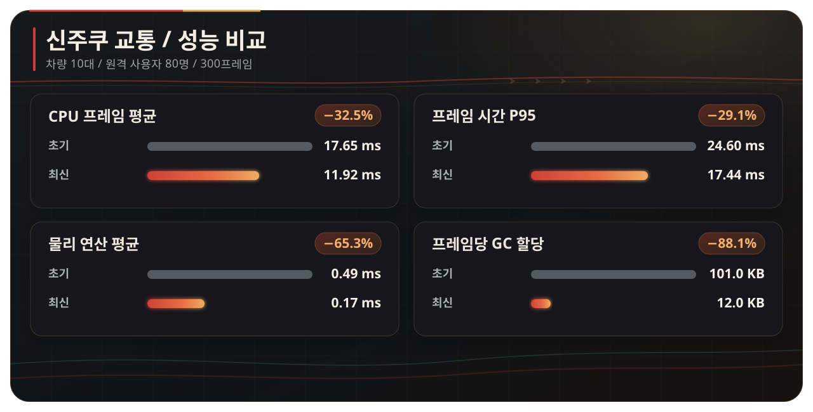
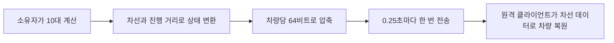

  <strong>한국어</strong> · <a href="./optimization.en.md">English</a> · <a href="./optimization.ja.md">日本語</a>

# 성능 최적화

## 비교 기준

- Profiler 전후 비교는 초기 스냅샷과 최신 스냅샷의 동일한 300프레임을 사용
- 초기 스냅샷은 차량별 매 프레임 실행 구조, 최신 스냅샷은 중앙 관리자와 분산 센서를 적용한 구조
- 활성 차량 10대와 ClientSim 원격 플레이어 80명이 한 지점에 모인 상태
- 프레임, PlayerLoop, Udon, Physics와 GC 수치는 Unity Profiler의 CPU 측정값
- 초당 실행 횟수는 60 FPS를 기준으로 계산

## 결과 요약

| Unity Profiler 항목 | 초기 스냅샷 | 최신 스냅샷 | 변화 |
| --- | ---: | ---: | ---: |
| 평균 CPU 프레임 시간 | 17.65 ms | **11.92 ms** | **32.5% 감소** |
| CPU 프레임 시간 P95 | 24.60 ms | **17.44 ms** | **29.1% 감소** |
| PlayerLoop 평균 | 9.03 ms | **5.46 ms** | **39.5% 감소** |
| Physics.Simulate 평균 | 0.49 ms | **0.17 ms** | **65.3% 감소** |
| 프레임당 GC 할당 평균 | 101.0 KB | **12.0 KB** | **88.1% 감소** |
| Udon 평균 | **0.82 ms** | 1.08 ms | 31.7% 증가 |

최신 스냅샷에는 중앙 시뮬레이션, 차선 변경, 상태 압축과 원격 보간이 포함되어 Udon 평균이 `0.82 ms → 1.08 ms`로 늘었습니다. PlayerLoop, Physics와 GC가 더 크게 줄어 전체 CPU 프레임 시간은 32.5% 감소했습니다.

## 1. 차량마다 매 프레임 계산하던 문제

### 문제

이전 `CarNavController`는 활성 차량마다 매 프레임 아래 작업을 실행했습니다.

- 목적지 방향과 거리 계산
- `Physics.BoxCast`로 앞차, 플레이어, 신호, 장애물 검사
- 속도와 회전 계산 후 Transform 이동
- 바퀴 회전
- `RequestSerialization()` 호출

활성 차량이 10대라면 60 FPS에서 주행 판단과 BoxCast가 각각 초당 600회 실행됩니다. 프레임 속도가 달라지면 주행 판단 횟수와 차량 이동 결과도 함께 달라졌습니다.

### 적용한 기술

차선의 위치와 연결 관계를 에디터에서 미리 만들고, `TrafficSimulationManager` 한 곳에서 모든 차량을 계산하도록 바꿨습니다.

- 주행 판단은 0.1초 고정 간격으로 실행
- 긴 프레임 뒤에 계산이 한꺼번에 쌓이지 않도록 프레임당 최대 4회까지만 보정
- 앞차와 신호는 물리 검사가 아니라 차선 진행 거리로 계산
- 플레이어와 고정 장애물만 소유자가 물리 검사
- 활성 차량 전체를 한 번에 검사하지 않고 프레임당 2대씩 순서대로 갱신

### 처리 횟수 변화

| 계산 | 이전 | 현재 | 변화 |
| --- | ---: | ---: | ---: |
| 한 프레임에 검사하는 차량 | 10대 | 2대 | **80% 감소** |
| 차량 10대 전체 검사 | 한 프레임에 집중 | 5프레임에 분산 | 부하 분산 |

## 2. 매 프레임 네트워크 전송을 요청하던 문제

### 문제

이전 코드는 차량 10대가 각각 매 프레임 `RequestSerialization()`을 호출했습니다. `CarSpawner`와 신호등도 같은 방식이었습니다.

60 FPS에서 계산하면 다음과 같습니다.

- 차량 10대: 600회/초
- 스포너: 60회/초
- 신호등: 60회/초
- 합계: 720회/초

`720회/초`는 실제 패킷 수가 아니라 코드에서 `RequestSerialization()`을 호출한 횟수입니다. 차량마다 상태와 Transform 동기화가 나뉘어 있어 전송 시점과 소유권도 여러 오브젝트에서 따로 관리했습니다.

### 적용한 기술

차량의 월드 위치와 회전을 보내는 대신, 모든 사용자가 공유하는 차선 위의 상태만 보냅니다.

- 소유자 한 명만 차량 계산
- 최대 16대의 상태를 `int` 배열 두 개에 저장
- 차량 한 대당 64비트에 활성 상태, 차선, 진행 거리, 속도, 가속도, 차선 변경 상태를 기록
- 시퀀스와 소유권 세대 번호로 오래된 상태 제외
- 직렬화가 진행 중이거나 네트워크가 막힌 경우 새 요청을 쌓지 않음
- 신호등은 매 프레임 시간이 아니라 주기 시작 서버 시각을 공유

### 전송 요청 변화

교통 관리자는 0.25초마다 스냅샷을 만들어 정상 실행 중 초당 4회 전송을 요청합니다. 신호등은 시작할 때와 마스터가 바뀔 때만 전송합니다.

| 항목 | 이전 | 현재 | 변화 |
| --- | ---: | ---: | ---: |
| 정상 실행 중 직렬화 요청 | 720회/초 | 4회/초 | **99.4% 감소** |

차량 16대의 상태 128바이트와 공통 값 12바이트를 합쳐 원시 데이터를 총 140바이트로 구성했습니다.

관련 구현은 [`TrafficSimulationManager.cs`](../Assets/Shinjuku%20Udon/Traffic/TrafficSimulationManager.cs)와 [`ShinhoTime.cs`](../Assets/Shinjuku%20Udon/Traffic/Shinho/ShinhoTime.cs)에서 확인할 수 있습니다.

## 3. 낮은 전송 주기에서 차량이 끊겨 보이던 문제

### 문제

전송 요청을 초당 4회로 낮추면, 받은 위치를 그대로 적용했을 때 원격 차량이 0.25초마다 움직여 보입니다. 패킷이 늦게 도착하는 순간에는 정지와 이동이 반복됩니다.

### 적용한 기술

- 최근 두 스냅샷을 저장하고 그 사이를 보간
- 실제 패킷 도착 간격에 맞춰 표시 지연을 0.35~1.25초 사이에서 조정
- 보간 범위를 벗어났을 때만 최대 0.15초 예측
- 차선 진행 거리를 기준으로 위치와 회전을 함께 복원
- 차선 변경·긴급 회피·후진 복구 상태까지 차량당 64비트로 압축

동기화 데이터는 늘리지 않고, 차량 위치와 회전은 매 프레임 보간해 끊겨 보이지 않도록 했습니다.

## 4. 일정한 간격으로 프레임 시간이 튀던 문제

### 문제

초기 시스템은 차량마다 계산과 물리 감지를 따로 실행해, 사용자와 차량이 많을 때 느린 프레임이 반복됐습니다. Profiler Timeline에서는 차량 전체의 센서 검사가 같은 프레임에 몰리는 구간도 확인했습니다.

### 적용한 기술

신호 정지는 베이크된 정지선 계산으로 분리하고, 차선 변경 감지 범위는 규칙별로 미리 계산했습니다. 플레이어 물리 감지는 소유자만 실행하며 차량 센서를 프레임당 2대씩 갱신합니다. 차량 10대의 검사가 5프레임에 나뉘어 한 프레임에 집중되지 않습니다.

### 결과

초기 스냅샷과 최신 스냅샷을 비교하면 CPU 프레임 시간 P95는 `24.60 ms → 17.44 ms`로 29.1% 감소했습니다. 평균 CPU 프레임 시간도 32.5% 줄어, 평균 성능과 반복적으로 느린 구간이 함께 개선됐습니다. 모델, 머티리얼과 렌더링 설정은 그대로 유지했습니다.

## 5. 신주쿠의 형태를 살린 모델 최적화

### 문제

환경 모델을 한 덩어리로 합치면 가려진 영역까지 함께 렌더링되고, 너무 잘게 나누면 렌더러와 머티리얼 호출이 늘어나는 문제가 있었습니다.

### 적용한 설정과 수치

| 항목 | 현재 설정 |
| --- | ---: |
| 환경 모델 | 246,921삼각형, 240개 메시 |
| 머티리얼 | 77개, 렌더러 머티리얼 슬롯 313개 |
| 정적 배칭 대상 | 392개 오브젝트 |
| 오클루더 | 330개 오브젝트 |
| 오클루전 데이터 | 3.28MB |
| 베이크 조명 적용 메시 | 약 220개 |
| 라이트맵 | 4096 3장 + 512 1장 |
| 모델용 메시 콜라이더 | 2개 |
| 블렌드셰이프 | 4개 메시의 41개, 2,624삼각형 |

- 건물과 거리 오브젝트를 구역별로 분리하고 오클루전 컬링 적용
- 정적 오브젝트 392개에 정적 배칭 적용
- 약 220개 메시에 Bakery 베이크 조명 적용
- 그림자가 필요하지 않은 렌더러 264개의 그림자 수신 비활성화
- 정적 렌더러 247개의 모션 벡터 비활성화
- 메시 Read/Write 비활성화, 버텍스 용접 및 라이트맵 UV 생성
- 이동에 필요한 메시 콜라이더 2개만 사용

## 관련 제작 도구

| 구현 | 해결한 문제 | 코드 |
| --- | --- | --- |
| 차선 데이터 베이킹 | 실행 중 차선 검색을 줄이고 끊어진 연결을 빌드 전에 확인 | [`TrafficLaneBakerEditor.cs`](../Assets/Shinjuku%20Udon/Traffic/Editor/TrafficLaneBakerEditor.cs) |
| 차량·센서 상태 표시 | 센서 범위, 현재 차선, 목표 차선, 네트워크 상태를 Scene View에서 확인 | [`TrafficSimulationManagerEditor.cs`](../Assets/Shinjuku%20Udon/Traffic/Editor/TrafficSimulationManagerEditor.cs) |
| 80명 스트레스 테스트 | 주기적인 프레임 드랍을 같은 조건에서 다시 만들고 구간별로 확인 | [`TrafficPlayerStressTestEditor.cs`](../Assets/Editor/TrafficPlayerStressTestEditor.cs) |

[README로 돌아가기](../README.md)
