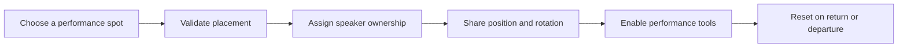
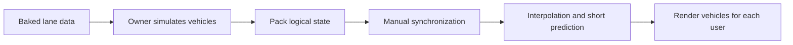

  <a href="./README.md">한국어</a> · <strong>English</strong> · <a href="./README.ja.md">日本語</a>

  

<h1 align="center">Shinjuku Live Street</h1>

  <strong>A VRChat world where anyone can start a street performance and anyone passing by can become part of the audience.</strong>

  <a href="https://vrchat.com/home/world/wrld_c82a5c14-97a5-4782-a034-d897d2d943a2/info"><strong>Visit in VRChat</strong></a>
  ·
  <a href="https://x.com/search?q=%23VRSJK&src=typed_query&f=live"><strong>Explore #VRSJK</strong></a>
  ·
  <a href="#code-map"><strong>Browse the code</strong></a>

---

## About the world

Shinjuku Live Street brings the light, sound, and human density of a Shinjuku night into VRChat. It is a social world built around street performances.

This is not a venue where visitors only watch a fixed stage. Performers choose their own spot, sing, or play an instrument, while people walking through the city naturally become the audience. After a set, performers and listeners talk, take group photos, and carry the night into the community.

| Published | Platform | Capacity | My role |
| --- | --- | ---: | --- |
| April 4, 2025 | VRChat | Up to 80 | Unity and UdonSharp world systems |

## What happens here

Posts shared under `#VRSJK` show that the world is shaped by the people using it rather than by one prescribed activity.

| Performers | Audience | What remains |
| --- | --- | --- |
| Solo singers, instrumentalists, and bands turn different parts of the street into a stage. | Visitors stop to listen, dance, cheer, or simply enjoy a performance quietly. | Performers and listeners talk, take group photos, and share moments from the night through `#VRSJK`. |

Some visitors arrive for a scheduled performance. Others follow a friend into the world and unexpectedly stay for a stranger's song. That chance encounter is the experience Shinjuku Live Street is designed to create.

> Community performances and visit records can be found through the [#VRSJK search on X](https://x.com/search?q=%23VRSJK&src=typed_query&f=live).

## What I built

I focused on the systems that let people begin a performance without friction and experience the same moment together.

### Tools for starting a performance

- A portable speaker placement flow with separate desktop and VR input handling.
- A holographic preview that checks slope, distance, and available speaker count before placement.
- Ownership and transform synchronization, including state delivery to late joiners.
- A unified return flow that resets voice, screen, drawing tools, and media state when the performer leaves or returns the speaker.

### Shared-world interactions

- Stage controls adjust the performer's voice range and gain for the audience.
- Global state is separated from settings that only need to affect the local user.
- Posters, portals, teleportation, object toggles, and recovery logic are implemented as small independent UdonSharp components.

## Traffic as a living backdrop

Traffic is not the subject of the world. It is the moving backdrop behind the people gathered there. Cars react to signals and surrounding vehicles so the city continues to feel active while a performance is taking place.

If every client simulates traffic independently, the results drift apart. Sending every transform continuously would also be expensive. Instead, one owner simulates the vehicles and remote users reconstruct their movement from compact logical state.

| Area | Implementation |
| --- | --- |
| Simulation | Fixed 0.1-second step with a per-frame catch-up limit |
| State transfer | Lane, distance, speed, and related state packed into 64 bits per vehicle for up to 16 vehicles |
| Remote playback | Jitter-aware interpolation and up to 0.15 seconds of short prediction |
| Ownership changes | Generation and sequence checks reject stale state and resume from the latest snapshot |
| Physics checks | Owner-only sensors distributed across vehicles to spread frame cost |

## Tooling for world production

Manually entering lane arrays and discovering errors only at runtime does not scale with the world. I built an editor baker that converts scene lanes into runtime data, plus visualization tools for inspecting vehicles, sensors, and network state directly in the Scene view.

- Automatic lane sampling and connection generation
- Validation for broken links and invalid settings
- Visualization of vehicle state, sensor ranges, and target lanes
- Stress testing for multi-player conditions

## Code map

| Area | Key files | Responsibility |
| --- | --- | --- |
| Performance equipment | [`SpeakerManager.cs`](./Assets/Shinjuku%20Udon/Speaker/v2.7/SpeakerManager.cs), [`SpeakerController.cs`](./Assets/Shinjuku%20Udon/Speaker/v2.7/SpeakerController.cs) | Speaker placement, validation, ownership, late-join sync, and reset |
| Stage voice | [`VoiceRange.cs`](./Assets/Shinjuku%20Udon/Speaker/VoiceRange.cs) | Shared performer voice range and gain |
| Shared interactions | [`ObjectGlobalToggle.cs`](./Assets/Shinjuku%20Udon/ObjectToggle/ObjectGlobalToggle.cs), [`ObjectLocalToggle.cs`](./Assets/Shinjuku%20Udon/ObjectToggle/ObjectLocalToggle.cs) | Separation of global and local state |
| Traffic runtime | [`TrafficSimulationManager.cs`](./Assets/Shinjuku%20Udon/Traffic/TrafficSimulationManager.cs) | Simulation, state packing, transfer, and remote playback |
| Lane data | [`TrafficLaneDatabase.cs`](./Assets/Shinjuku%20Udon/Traffic/TrafficLaneDatabase.cs) | Baked lane lookup and vehicle pose reconstruction |
| Editor tooling | [`TrafficLaneBakerEditor.cs`](./Assets/Shinjuku%20Udon/Traffic/Editor/TrafficLaneBakerEditor.cs), [`TrafficSimulationManagerEditor.cs`](./Assets/Shinjuku%20Udon/Traffic/Editor/TrafficSimulationManagerEditor.cs) | Lane baking, validation, and visualization |
| World utilities | [`PosterSlide.cs`](./Assets/Shinjuku%20Udon/Posters/PosterSlide.cs), [`PortalToggle.cs`](./Assets/Shinjuku%20Udon/Portal/PortalToggle.cs), [`CollisionTeleport.cs`](./Assets/Shinjuku%20Udon/Teleport/CollisionTeleport.cs) | Poster transitions, portals, and teleportation |

## Repository scope

This repository is not a complete Unity project. It contains only original C# and UdonSharp code plus documentation. Scenes, prefabs, models, images, audio, video, materials, animations, shaders, and Unity `.meta` files are not included.

<strong>SDKs, packages, and third-party components</strong>

### Development environment

- Unity `2022.3.22f1`
- VRChat SDK - Worlds `3.8.1`
- UdonSharp
- TextMesh Pro

### Third-party components used in the world

- Topaz Chat `0.1.6`
- lilToon `1.10.3`
- VRWorldToolkit `3.2.1`
- AVPro Video
- Bakery GPU Lightmapper
- QvPen
- IwaSync3 / HoshinoLabs
- Media Manager
- Mochie Shaders
- EasyTextures
- VRC Players Only Mirror
- VRC Music Event Calendar
- Year Progress Bar
- imagePad
- Lura's Switch (Udon)
- Prototype Collection
- AllSkyFree
- Noriben Lunch shader assets
- Models and environment resources from Atelier Rayrell, RIONESTA, Zelkova Tree, and other creators

Third-party components are not included in this repository. Their respective authors and distributors retain all rights and define their own license terms.

## Copyright

No open-source license is granted for the original code in this repository. The code may not be used, modified, or redistributed without separate permission. Rights to third-party components and world assets remain with their respective authors.

---

  <a href="https://vrchat.com/home/world/wrld_c82a5c14-97a5-4782-a034-d897d2d943a2/info">VRChat World</a>
  ·
  <a href="https://x.com/search?q=%23VRSJK&src=typed_query&f=live">#VRSJK</a>
  ·
  <a href="https://github.com/hjcud/Shinjuku-Live-Street">GitHub</a>

