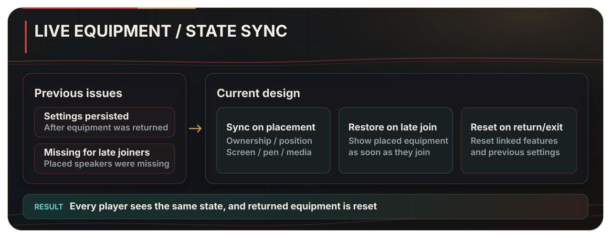
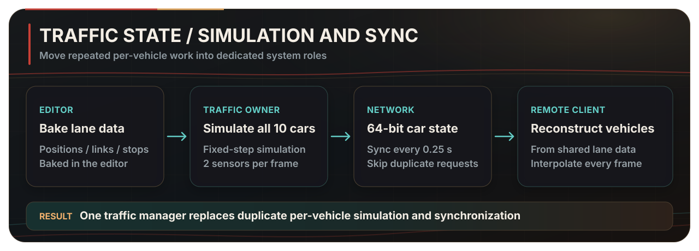

  <a href="./README.md">한국어</a> · <strong>English</strong> · <a href="./README.ja.md">日本語</a>

  

<h1 align="center">Shinjuku Live Street</h1>

  <strong>A VRChat social world where anyone can start a street performance and passersby naturally become the audience.</strong>

  Music begins throughout the streets, drawing people together around each performance.

  <a href="https://vrchat.com/home/world/wrld_c82a5c14-97a5-4782-a034-d897d2d943a2/info"><strong>Open the world in VRChat ↗</strong></a>

---

## About the world

Shinjuku Live Street is a **VRChat social world centered on street performances**, set in the streets of Shinjuku.

There is no fixed stage. Performers can set up anywhere along the streets, and passersby can stop to listen and join the audience.

<table align="center">
  <tr>
    <td width="180" align="center"> <strong>1,693,697</strong> Total visits</td>
    <td width="180" align="center"> <strong>64,453</strong> Favorites</td>
    <td width="180" align="center"> <strong>Up to 80</strong> Capacity</td>
  </tr>
</table>

VRChat social world · Unity / UdonSharp · Two-person team

Visit and favorite counts · September 3, 2026

## Street performances and community

<table>
  <tr>
    <td width="50%" valign="top"><strong>Perform anywhere along the street</strong> Solo vocals, instrumentals, and full-band sets using different parts of the street as a stage</td>
    <td width="50%" valign="top"><strong>Passersby become the audience</strong> People can stop at a performance they discover and enjoy it together</td>
  </tr>
</table>

  <a href="https://x.com/search?q=%23VRSJK&src=typed_query&f=live"><strong>View performances and visit records on #VRSJK ↗</strong></a>

  

---

  <strong>Planned improvements and suggestions</strong>  
  <a href="https://github.com/hjcud/Shinjuku-Live-Street/issues"><strong>View planned work →</strong></a>
  &nbsp;·&nbsp;
  <a href="https://github.com/hjcud/Shinjuku-Live-Street/issues/new"><strong>Share feedback →</strong></a>

---

## Recent development and improvements

The live-equipment synchronization and traffic simulation were redesigned to keep shared state consistent with many users connected while reducing repeated CPU, physics, and GC work.

### Shared live equipment — consistent state from placement to return

Portable speakers could retain part of their linked state after being returned or left behind, while late joiners could miss speakers already placed in the world.

  

Everyone sees the same equipment state, and returned equipment no longer retains the previous user's settings.

### Traffic simulation — centralizing repeated per-vehicle work

Each vehicle previously calculated its destination, ran a `BoxCast`, moved its Transform, and requested serialization every frame. CPU, physics, and GC costs rose together as the number of vehicles and players increased.

  

The traffic owner calculates all ten vehicles in one place and sends each vehicle's state as a 64-bit record. Remote clients rebuild the vehicles from the same lane data and interpolate every frame to reduce visible stepping.

<strong>View the runtime debug screen</strong>

  
   
  Baked lanes, vehicle occupancy, predicted positions, and obstacle sensor ranges

### Performance results

Ten vehicles and 80 remote players simulated with ClientSim were placed at the same location, and 300 frames were measured in both the initial and latest states. Average CPU frame time fell from `17.65 ms to 11.92 ms`, while P95 frame time fell from `24.60 ms to 17.44 ms`. Physics time fell by 65.3%, and GC allocation per frame by 88.1%.

Vehicle position and rotation are interpolated every frame so motion remains smooth between simulation updates.

[Read the test conditions and implementation details](./Docs/optimization.en.md)

## Model and rendering optimization

  
   
  Left: normal render · Right: wireframe captured from the same camera

The environment is divided into sections so occlusion culling can exclude sections outside the camera view. Fixed objects use static batching, while street and building lighting is baked.

<table align="center">
  <tr>
    <td width="260" align="center"><strong>Model geometry</strong> 246,921 triangles · 240 environment meshes</td>
    <td width="260" align="center"><strong>Rendering</strong> 392 static-batched objects · 330 occluders</td>
    <td width="260" align="center"><strong>Collision</strong> 2 mesh colliders</td>
  </tr>
</table>

Baked lighting is applied to approximately 220 meshes. The scene uses three 4096×4096 lightmaps and one 512×512 lightmap.

## Code map

| Area | Key files | Responsibility |
| --- | --- | --- |
| Performance equipment | [`SpeakerManager.cs`](./Assets/Shinjuku%20Udon/Speaker/v2.7/SpeakerManager.cs), [`SpeakerController.cs`](./Assets/Shinjuku%20Udon/Speaker/v2.7/SpeakerController.cs) | Speaker placement, validation, ownership, late-join sync, and reset |
| Stage voice | [`VoiceRange.cs`](./Assets/Shinjuku%20Udon/Speaker/VoiceRange.cs) | Shared performer voice range and gain |
| Shared interactions | [`ObjectGlobalToggle.cs`](./Assets/Shinjuku%20Udon/ObjectToggle/ObjectGlobalToggle.cs), [`ObjectLocalToggle.cs`](./Assets/Shinjuku%20Udon/ObjectToggle/ObjectLocalToggle.cs) | Separation of global and local state |
| Traffic runtime | [`TrafficSimulationManager.cs`](./Assets/Shinjuku%20Udon/Traffic/TrafficSimulationManager.cs) | Simulation, state packing, transfer, and remote reconstruction |
| Lane data | [`TrafficLaneDatabase.cs`](./Assets/Shinjuku%20Udon/Traffic/TrafficLaneDatabase.cs) | Baked lane lookup and vehicle pose reconstruction |
| Editor tooling | [`TrafficLaneBakerEditor.cs`](./Assets/Shinjuku%20Udon/Traffic/Editor/TrafficLaneBakerEditor.cs), [`TrafficSimulationManagerEditor.cs`](./Assets/Shinjuku%20Udon/Traffic/Editor/TrafficSimulationManagerEditor.cs) | Lane baking, validation, and visualization |
| World utilities | [`PosterSlide.cs`](./Assets/Shinjuku%20Udon/Posters/PosterSlide.cs), [`PortalToggle.cs`](./Assets/Shinjuku%20Udon/Portal/PortalToggle.cs), [`CollisionTeleport.cs`](./Assets/Shinjuku%20Udon/Teleport/CollisionTeleport.cs) | Poster transitions, portals, and teleportation |

## Repository scope

This repository is not a complete Unity project. It contains only original C# and UdonSharp code plus documentation. Scenes, prefabs, models, images, audio, video, materials, animations, shaders, and Unity `.meta` files are not included.

<strong>SDKs, packages, and third-party components</strong>

### Development environment

- Unity `2022.3.22f1`
- VRChat SDK - Worlds `3.8.1`
- UdonSharp
- TextMesh Pro

### Third-party components used in the world

- Topaz Chat `0.1.6`
- lilToon `1.10.3`
- VRWorldToolkit `3.2.1`
- AVPro Video
- Bakery GPU Lightmapper
- QvPen
- IwaSync3 / HoshinoLabs
- Media Manager
- Mochie Shaders
- EasyTextures
- VRC Players Only Mirror
- VRC Music Event Calendar
- Year Progress Bar
- imagePad
- Lura's Switch (Udon)
- Prototype Collection
- AllSkyFree
- Noriben Lunch shader assets
- Models and environment resources from Atelier Rayrell, RIONESTA, Zelkova Tree, and other creators

Third-party components are not included in this repository. Their respective authors and distributors retain all rights and define their own license terms.

## Copyright

No open-source license is granted for the original code in this repository. The code may not be used, modified, or redistributed without separate permission. Rights to third-party components and world assets remain with their respective authors.

## Team

| Member | Role |
| --- | --- |
| [Artistoid](https://github.com/Artistoid) · [X @Artistoid_VRC](https://x.com/Artistoid_VRC) | Planning · Graphics · 3D modeling |
| [hjcud](https://github.com/hjcud) | Unity and UdonSharp system development and optimization |
