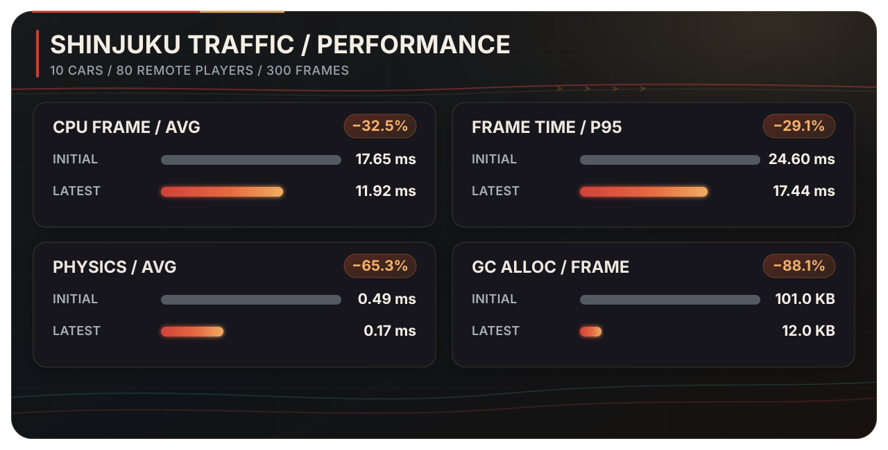
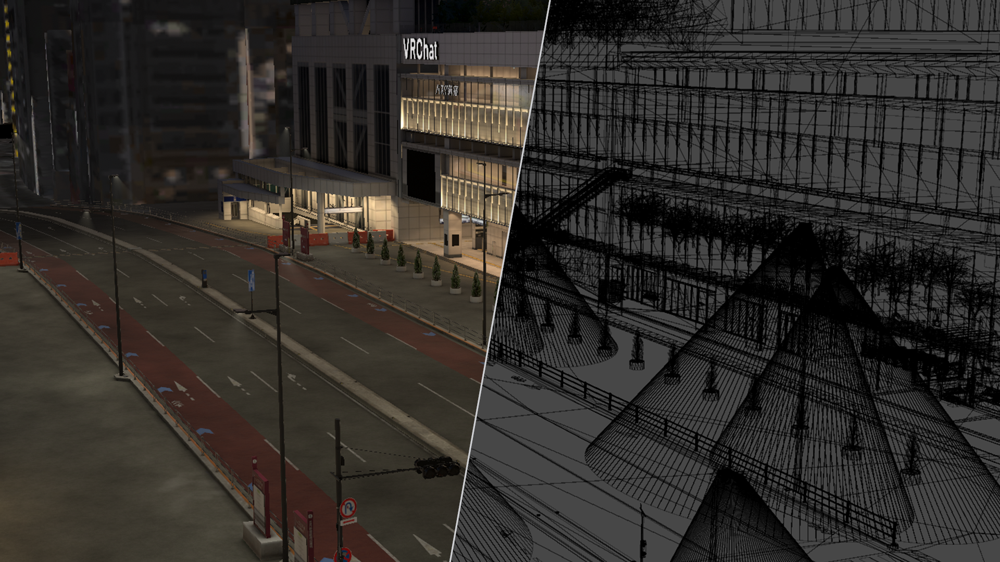

  <a href="./README.md">한국어</a> · <strong>English</strong> · <a href="./README.ja.md">日本語</a>

  

<h1 align="center">Shinjuku Live Street</h1>

  <strong>A VRChat world where anyone can start a street performance and anyone passing by can become part of the audience.</strong>

  <a href="https://vrchat.com/home/world/wrld_c82a5c14-97a5-4782-a034-d897d2d943a2/info"><strong>Visit in VRChat</strong></a>
  ·
  <a href="https://x.com/search?q=%23VRSJK&src=typed_query&f=live"><strong>Explore #VRSJK</strong></a>
  ·
  <a href="#code-map"><strong>Browse the code</strong></a>

---

## About the world

Shinjuku Live Street brings the light, sound, and human density of a Shinjuku night into VRChat. It is a social world built around street performances.

This is not a venue built around a single fixed stage. Performers choose their own spot, and people walking through the city naturally become the audience. After a set, performers and listeners talk, take photos, and carry the night into the community.

<table>
  <tr>
    <td width="33%" align="center"><strong>1,693,697</strong> Total visits</td>
    <td width="33%" align="center"><strong>64,453</strong> Favorites</td>
    <td width="33%" align="center"><strong>Up to 80</strong> Capacity</td>
  </tr>
  <tr>
    <td align="center"><strong>April 4, 2025</strong> Public release</td>
    <td align="center"><strong>August 31, 2026</strong> Latest world update</td>
    <td align="center"><strong>Version 207</strong> Unity · UdonSharp</td>
  </tr>
</table>

<a href="https://vrchat.com/home/world/wrld_c82a5c14-97a5-4782-a034-d897d2d943a2/info">Official VRChat world information</a> · Checked September 3, 2026 · Visit and favorite counts will change over time.

## What happens here

<!-- SCREENSHOT_SLOT: Add three externally hosted performance screenshots above these cards. Do not add the image files to this repository. -->

<table>
  <tr>
    <td width="33%" valign="top"><strong>Every corner can become a stage</strong> From solo vocals and instruments to full bands, the performer chooses where the show begins.</td>
    <td width="33%" valign="top"><strong>Passersby become the audience</strong> Visitors stop for someone they have never met, then listen, dance, and cheer together.</td>
    <td width="33%" valign="top"><strong>The night continues afterward</strong> Conversations and group photos shared under #VRSJK carry the performance beyond the world.</td>
  </tr>
</table>

Some visitors arrive for a scheduled performance. Others follow a friend into the world and unexpectedly stay for a stranger's song. Community performances and visit records can be found through the [#VRSJK search on X](https://x.com/search?q=%23VRSJK&src=typed_query&f=live).

## Recent work

Recent work addressed state mismatches in shared performance equipment and repeated calculations and transfers in the traffic system. Production and test tools were built alongside these changes so the same conditions can be reproduced and checked.

### Performance system: problems and solutions

The portable speaker carries more than its position. Ownership, voice gain, screens, drawing tools, and media all change with it. Returning a speaker or walking away could leave part of that state behind, while late joiners could miss speakers that had already been placed.

~~~mermaid
flowchart LR
    A["Preview placement Desktop · VR"] --> B["Validate placement 3 m · 30° slope"]
    B --> C["Assign ownership Sync position and rotation"]
    C --> D["Resend current state to late joiners"]
    D --> E["Detect return or distance Reset linked state"]
~~~

Distance, slope, and remaining capacity are checked before ownership is assigned and placement is synchronized. Returning a speaker or moving more than 5 m away resets its linked features together. Shared screens and drawing tools are also separated from local choices such as mirrors.

### Traffic system: problems and solutions

Traffic keeps the city moving behind the performances. In the first system, each vehicle calculated its destination, ran a `BoxCast`, moved its Transform, and requested serialization every frame. More vehicles meant more copies of the same work, while high-player-count tests exposed regular frame-time spikes.

  
   
  Baked lanes, vehicle occupancy, predicted positions, and obstacle sensor ranges during execution

~~~mermaid
flowchart LR
    subgraph BEFORE["Previous structure"]
        direction TB
        B1["Every vehicle decides every frame"]
        B2["Every vehicle runs BoxCast"]
        B3["Every vehicle moves and serializes"]
        B1 --> B2 --> B3
    end
    subgraph AFTER["Current structure"]
        direction TB
        A1["Bake lane data in the editor"]
        A2["One owner simulates ten vehicles"]
        A3["Update sensors for two vehicles per frame"]
        A4["Pack 64 bits per vehicle"]
        A5["Send every 0.25 s · interpolate remotely"]
        A1 --> A2 --> A3 --> A4 --> A5
    end
    BEFORE ==> AFTER
~~~

Leading vehicles and signals are evaluated through lane progress. Remote clients reconstruct vehicles on the same lane data and predict no more than 0.15 seconds ahead when a packet is late. Lane changes, emergency avoidance, and reverse recovery remain inside the same 64-bit record.

### Measured with Unity Profiler

The comparison uses the same 300-frame segment from the initial and latest snapshots, with ten cars and 80 ClientSim remote players gathered at one point. Average CPU frame time fell from `17.65 ms to 11.92 ms`, while P95—which represents recurring slow frames—fell from `24.60 ms to 17.44 ms`. Physics time fell by 65.3%, and GC allocation per frame by 88.1%.

`10 Hz` is the driving-decision rate, not the display refresh rate. Authority-side cars interpolate between simulation states, while remote cars interpolate received snapshots **on every rendered frame**. The model, materials, and render settings were not reduced. GPU frame time and image quality were not part of this comparison.

[Read the test conditions and implementation details](./Docs/optimization.en.md)

## Model and rendering setup

  
   
  Left: normal render · Right: wireframe captured from the same camera

Combining every building and sign into one large mesh can draw hidden alleys and objects together. Splitting everything too finely increases renderer and material submissions. The environment is divided so the shape of the Shinjuku streets remains recognizable while hidden areas can be culled by section.

<table>
  <tr>
    <td align="center"><strong>246,921</strong> Triangles</td>
    <td align="center"><strong>240</strong> Environment meshes</td>
    <td align="center"><strong>392</strong> Static-batched objects</td>
    <td align="center"><strong>330</strong> Occluders</td>
    <td align="center"><strong>2</strong> Mesh colliders</td>
  </tr>
</table>

Baked lighting covers approximately 220 meshes using three 4096 lightmaps and one 512 lightmap.

The pre-optimization model settings are unavailable, so these figures are labeled as current settings rather than performance gains.

## Code map

| Area | Key files | Responsibility |
| --- | --- | --- |
| Performance equipment | [`SpeakerManager.cs`](./Assets/Shinjuku%20Udon/Speaker/v2.7/SpeakerManager.cs), [`SpeakerController.cs`](./Assets/Shinjuku%20Udon/Speaker/v2.7/SpeakerController.cs) | Speaker placement, validation, ownership, late-join sync, and reset |
| Stage voice | [`VoiceRange.cs`](./Assets/Shinjuku%20Udon/Speaker/VoiceRange.cs) | Shared performer voice range and gain |
| Shared interactions | [`ObjectGlobalToggle.cs`](./Assets/Shinjuku%20Udon/ObjectToggle/ObjectGlobalToggle.cs), [`ObjectLocalToggle.cs`](./Assets/Shinjuku%20Udon/ObjectToggle/ObjectLocalToggle.cs) | Separation of global and local state |
| Traffic runtime | [`TrafficSimulationManager.cs`](./Assets/Shinjuku%20Udon/Traffic/TrafficSimulationManager.cs) | Simulation, state packing, transfer, and remote playback |
| Lane data | [`TrafficLaneDatabase.cs`](./Assets/Shinjuku%20Udon/Traffic/TrafficLaneDatabase.cs) | Baked lane lookup and vehicle pose reconstruction |
| Editor tooling | [`TrafficLaneBakerEditor.cs`](./Assets/Shinjuku%20Udon/Traffic/Editor/TrafficLaneBakerEditor.cs), [`TrafficSimulationManagerEditor.cs`](./Assets/Shinjuku%20Udon/Traffic/Editor/TrafficSimulationManagerEditor.cs) | Lane baking, validation, and visualization |
| World utilities | [`PosterSlide.cs`](./Assets/Shinjuku%20Udon/Posters/PosterSlide.cs), [`PortalToggle.cs`](./Assets/Shinjuku%20Udon/Portal/PortalToggle.cs), [`CollisionTeleport.cs`](./Assets/Shinjuku%20Udon/Teleport/CollisionTeleport.cs) | Poster transitions, portals, and teleportation |

## Repository scope

This repository is not a complete Unity project. It contains only original C# and UdonSharp code plus documentation. Scenes, prefabs, models, images, audio, video, materials, animations, shaders, and Unity `.meta` files are not included.

<strong>SDKs, packages, and third-party components</strong>

### Development environment

- Unity `2022.3.22f1`
- VRChat SDK - Worlds `3.8.1`
- UdonSharp
- TextMesh Pro

### Third-party components used in the world

- Topaz Chat `0.1.6`
- lilToon `1.10.3`
- VRWorldToolkit `3.2.1`
- AVPro Video
- Bakery GPU Lightmapper
- QvPen
- IwaSync3 / HoshinoLabs
- Media Manager
- Mochie Shaders
- EasyTextures
- VRC Players Only Mirror
- VRC Music Event Calendar
- Year Progress Bar
- imagePad
- Lura's Switch (Udon)
- Prototype Collection
- AllSkyFree
- Noriben Lunch shader assets
- Models and environment resources from Atelier Rayrell, RIONESTA, Zelkova Tree, and other creators

Third-party components are not included in this repository. Their respective authors and distributors retain all rights and define their own license terms.

## Copyright

No open-source license is granted for the original code in this repository. The code may not be used, modified, or redistributed without separate permission. Rights to third-party components and world assets remain with their respective authors.

## Team

| Member | Role |
| --- | --- |
| [hjcud](https://github.com/hjcud) | Unity and UdonSharp system development and optimization |
| [@Artistoid_VRC](https://x.com/Artistoid_VRC) | 3D modeling of the Shinjuku streets and environment |

---

  <a href="https://vrchat.com/home/world/wrld_c82a5c14-97a5-4782-a034-d897d2d943a2/info">VRChat World</a>
  ·
  <a href="https://x.com/search?q=%23VRSJK&src=typed_query&f=live">#VRSJK</a>
  ·
  <a href="https://github.com/hjcud/Shinjuku-Live-Street">GitHub</a>

