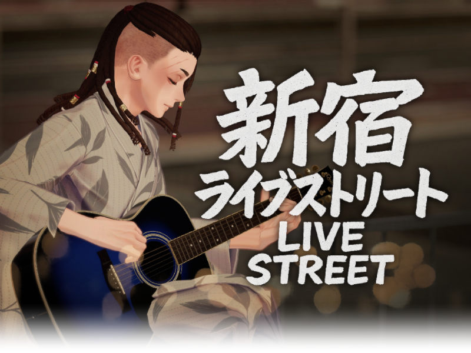
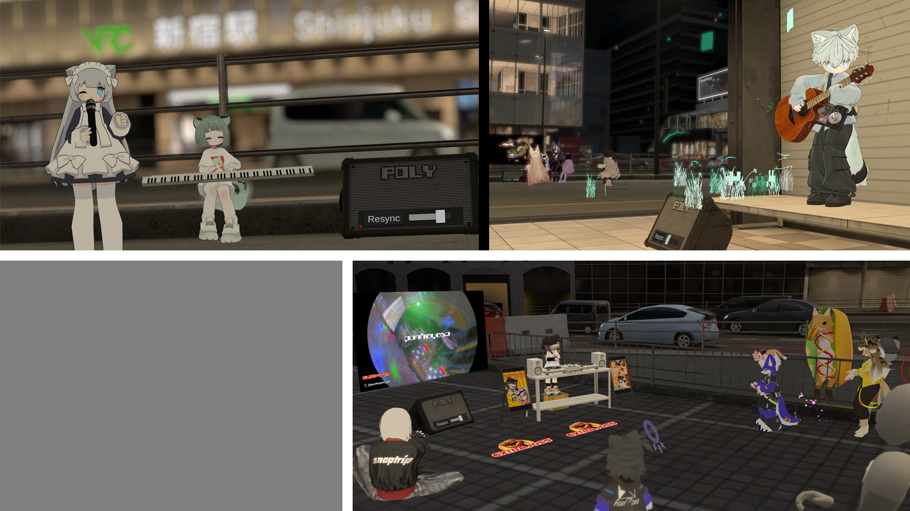
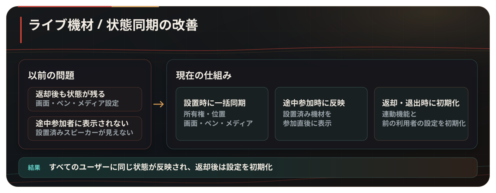
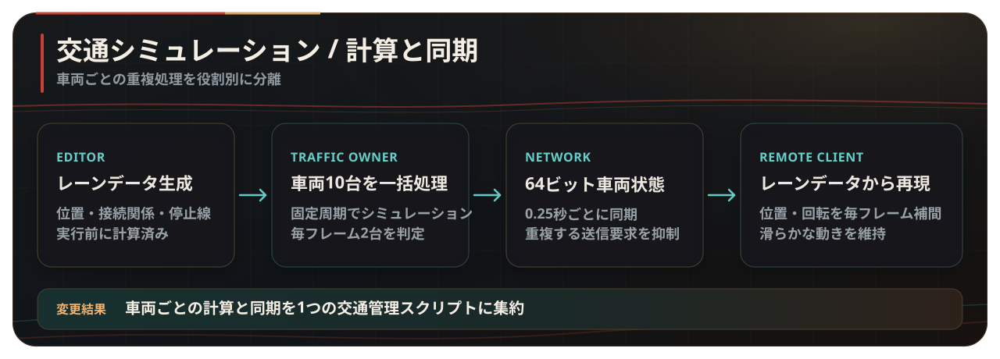
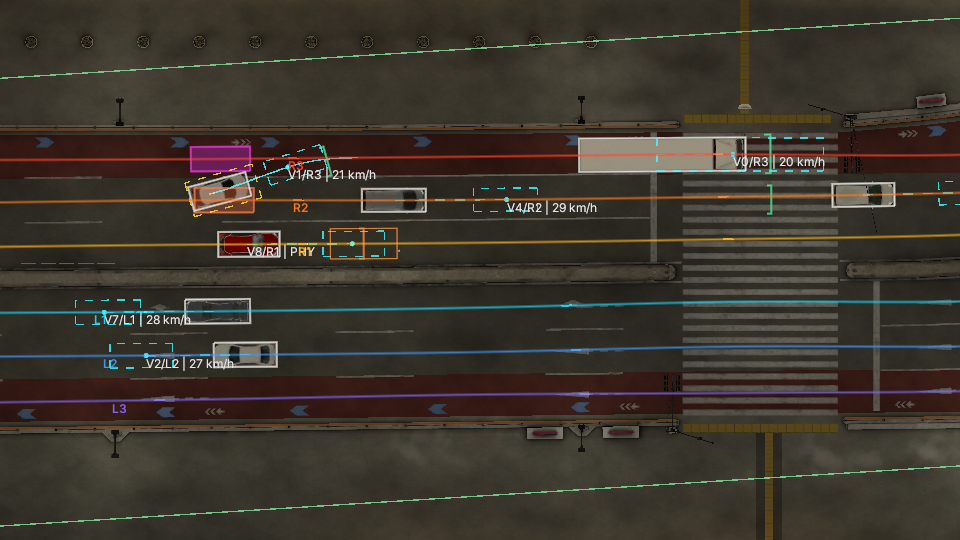
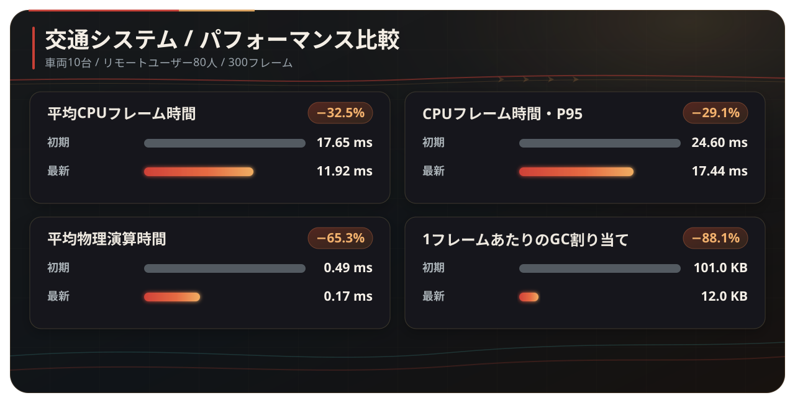
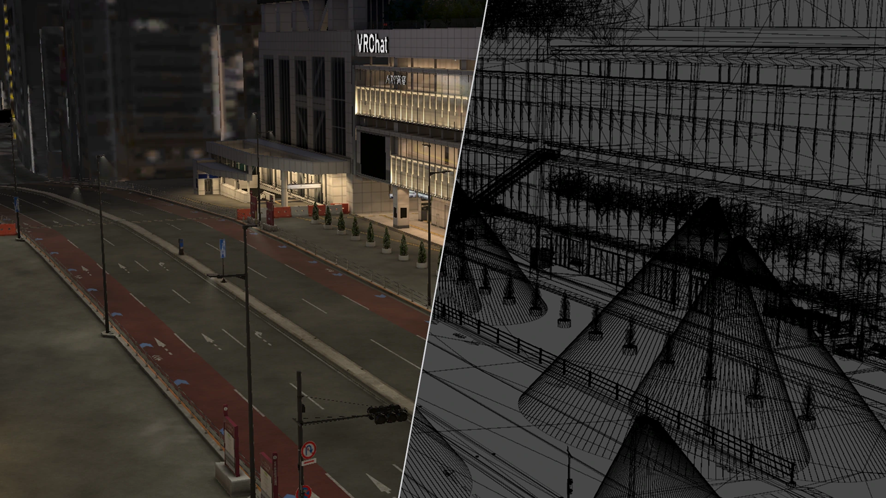

  <a href="./README.md">한국어</a> · <strong>日本語</strong> · <a href="./README.en.md">English</a>

  
  <h1>新宿ライブストリート</h1>

<strong>実行可能なUnityプロジェクトは含まれていません。作成したコードと主な開発内容を整理して公開するリポジトリです。</strong>

  <picture>
    <source media="(prefers-color-scheme: dark)" srcset="./Docs/images/world-intro.ja.svg">
    
  </picture>

<table align="center">
  <tr>
    <td width="180" align="center"> <strong>1,693,697回</strong> 累計訪問数</td>
    <td width="180" align="center"> <strong>64,453人</strong> お気に入り</td>
    <td width="180" align="center"> <strong>最大80人</strong> 定員</td>
  </tr>
</table>

  <a href="https://vrchat.com/home/world/wrld_c82a5c14-97a5-4782-a034-d897d2d943a2/info"><strong>VRChatでワールドを開く ↗</strong></a>

VRChatソーシャルワールド · Unity / UdonSharp · 2名で制作 訪問数・お気に入り数 · 2026年9月3日時点

## ストリートライブとコミュニティ

  <picture>
    <source media="(prefers-color-scheme: dark)" srcset="./Docs/images/community-highlights.ja.svg">
    
  </picture>

  <a href="https://x.com/search?q=%23VRSJK&src=typed_query&f=live"><strong>#VRSJKで実際のライブやワールドの様子を見る ↗</strong></a>

  

https://github.com/user-attachments/assets/9ec884f0-df47-49f0-b39f-327cdfda0ede

動画・写真提供：<a href="https://x.com/KixiVRC">@KixiVRC</a> · 写真提供：<a href="https://x.com/taque_0409">@taque_0409</a>, <a href="https://x.com/ponhayate_vrc">@ponhayate_vrc</a>

---

  
  

---

## 最近の改善

2026年9月3日時点

ライブ機材の同期と交通シミュレーションを再設計しました。同時接続が多い場面でも機材の状態を安定して共有できるようにし、CPUフレーム時間、物理演算時間、1フレームあたりのGC割り当てを削減しました。

### ライブ機材の同期 — 設置から返却まで状態を一貫して管理

スピーカーの返却後や利用者が離れたあとに一部機能の状態が残り、途中参加したユーザーには設置済みのスピーカーが見えない問題がありました。

  

すべてのユーザーに同じ機材の状態が反映され、返却後の機材には前の利用者の設定が残らないようにしました。

### 交通シミュレーション — 車両ごとの重複処理を中央へ集約

各車両が毎フレーム、目的地の計算、`BoxCast`、Transformの更新、シリアライズ要求を個別に行っていたため、車両とユーザーが増えるほどCPUフレーム時間、物理演算時間、GC割り当ても増えていました。

  

交通オーナーが10台の走行状態を1つの管理スクリプトで計算し、各車両の状態を64ビットに圧縮して送信します。リモート側は同じレーンデータから車両を再現し、毎フレーム補間して滑らかな動きを保ちます。

<strong>実行時のデバッグ表示を見る</strong>

  
   
  レーンデータ、車両の占有範囲、予測位置、障害物センサー範囲

### パフォーマンス改善結果

Unity Editor・ClientSim環境での同一条件比較であり、実際のVRChatインスタンスでは結果が異なる場合があります。

車両10台とClientSimで再現したリモートプレイヤー80人を同じエリアに集め、Unity Editor上で初期・最新スナップショットをそれぞれ300フレーム計測しました。平均CPUフレーム時間は`17.65 ms → 11.92 ms`、P95フレーム時間は`24.60 ms → 17.44 ms`まで減少しました。物理処理時間は65.3%、1フレームあたりのGC割り当ては88.1%削減しています。車両の位置と回転を毎フレーム補間することで、シミュレーション更新の間も滑らかに見えるようにしました。

  <a href="./Docs/optimization.ja.md"><strong>測定条件と実装の詳細を見る →</strong></a>

---

## モデルと描画の最適化

  
   
  左：通常レンダリング · 右：同じカメラから撮影したワイヤーフレーム

環境モデルをエリアごとに分割し、オクルージョンカリング、スタティックバッチング、ベイクドライティングを適用して、リアルタイムの描画負荷を抑えました。

<table align="center">
  <tr>
    <td width="260" align="center"><strong>モデル構成</strong> 三角形 246,921個 環境メッシュ 240個 メッシュコライダー 2個</td>
    <td width="260" align="center"><strong>描画処理</strong> スタティックバッチング 392個 オクルーダー 330個</td>
    <td width="260" align="center"><strong>ベイクドライティング</strong> 適用メッシュ 約220個 4096×4096 3枚 512×512 1枚</td>
  </tr>
</table>

## コード構成

| 分野 | 主なファイル | 役割 |
| --- | --- | --- |
| ライブ機材 | [`SpeakerManager.cs`](./Assets/Shinjuku%20Udon/Speaker/v2.7/SpeakerManager.cs), [`SpeakerController.cs`](./Assets/Shinjuku%20Udon/Speaker/v2.7/SpeakerController.cs) | スピーカー設置、検証、所有権、途中参加者との同期、初期化 |
| ステージ音声 | [`VoiceRange.cs`](./Assets/Shinjuku%20Udon/Speaker/VoiceRange.cs) | 出演者のボイス範囲とゲインの同期 |
| 共有操作 | [`ObjectGlobalToggle.cs`](./Assets/Shinjuku%20Udon/ObjectToggle/ObjectGlobalToggle.cs), [`ObjectLocalToggle.cs`](./Assets/Shinjuku%20Udon/ObjectToggle/ObjectLocalToggle.cs) | グローバル状態とローカル状態の分離 |
| 交通処理 | [`TrafficSimulationManager.cs`](./Assets/Shinjuku%20Udon/Traffic/TrafficSimulationManager.cs) | 車両計算、状態圧縮、送信、リモート車両の復元 |
| レーンデータ | [`TrafficLaneDatabase.cs`](./Assets/Shinjuku%20Udon/Traffic/TrafficLaneDatabase.cs) | ベイク済みレーンの参照と車両姿勢の復元 |
| エディターツール | [`TrafficLaneBakerEditor.cs`](./Assets/Shinjuku%20Udon/Traffic/Editor/TrafficLaneBakerEditor.cs), [`TrafficSimulationManagerEditor.cs`](./Assets/Shinjuku%20Udon/Traffic/Editor/TrafficSimulationManagerEditor.cs) | レーンのベイク、検証、可視化 |
| ワールド機能 | [`PosterSlide.cs`](./Assets/Shinjuku%20Udon/Posters/PosterSlide.cs), [`PortalToggle.cs`](./Assets/Shinjuku%20Udon/Portal/PortalToggle.cs), [`CollisionTeleport.cs`](./Assets/Shinjuku%20Udon/Teleport/CollisionTeleport.cs) | ポスター切り替え、ポータル、テレポート |

## リポジトリについて

このリポジトリは、ワールドを実行できる完全なUnityプロジェクトではありません。自作のC#・UdonSharpコード、技術資料、README用に制作した画像のみを公開しています。ワールドの動作に必要なUnityシーン、Prefab、モデル、テクスチャ、音声、動画、マテリアル、アニメーション、シェーダー、`.meta`ファイル、外部アセットは含まれていません。

<strong>使用したSDK・パッケージ・外部コンポーネント</strong>

### 開発環境

- Unity `2022.3.22f1`
- VRChat SDK - Worlds `3.8.1`
- UdonSharp
- TextMesh Pro

### ワールドで使用した外部コンポーネント

- Topaz Chat `0.1.6`
- lilToon `1.10.3`
- VRWorldToolkit `3.2.1`
- AVPro Video
- Bakery GPU Lightmapper
- QvPen
- IwaSync3 / HoshinoLabs
- Media Manager
- Mochie Shaders
- EasyTextures
- VRC Players Only Mirror
- VRC Music Event Calendar
- Year Progress Bar
- imagePad
- Lura's Switch (Udon)
- Prototype Collection
- AllSkyFree
- Noriben Lunch shader assets
- Atelier Rayrell、RIONESTA、Zelkova Tree、その他クリエイターによるモデル・環境素材

外部コンポーネントはこのリポジトリに含まれていません。各コンポーネントの権利は作者・配布元に帰属し、利用にはそれぞれのライセンス条件が適用されます。

[外部ライセンス表記を見る →](./Docs/THIRD_PARTY_NOTICES.md)

## 著作権と利用条件

> [!IMPORTANT]
> このリポジトリはオープンソースではなく、**ソースコード公開型（source-available）**です。GitHub上での閲覧・フォークを超えて、コードを複製・改変・再配布・商用利用する場合は、事前の書面による許可が必要です。

[著作権と利用条件の詳細](./COPYRIGHT.ja.md) · [利用許可を申請する](https://github.com/hjcud/Shinjuku-Live-Street/issues/new?template=7-usage-permission-request.yml)

## チーム

| メンバー | 担当 |
| --- | --- |
| [Artistoid](https://github.com/Artistoid) · [X @Artistoid_VRC](https://x.com/Artistoid_VRC) | 企画 · グラフィック · 3Dモデリング |
| [hjcud](https://github.com/hjcud) | Unity・UdonSharpシステムの開発・最適化 |
