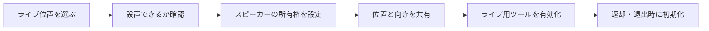
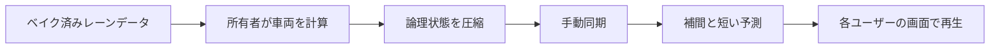

  <a href="./README.md">한국어</a> · <a href="./README.en.md">English</a> · <strong>日本語</strong>

  

<h1 align="center">新宿ライブストリート</h1>

  <strong>新宿の夜道で、誰もがライブを始められ、通りすがりの誰もが観客になれるVRChatワールド</strong>

  <a href="https://vrchat.com/home/world/wrld_c82a5c14-97a5-4782-a034-d897d2d943a2/info"><strong>VRChatで訪れる</strong></a>
  ·
  <a href="https://x.com/search?q=%23VRSJK&src=typed_query&f=live"><strong>#VRSJKを見る</strong></a>
  ·
  <a href="#コード構成"><strong>コードを見る</strong></a>

---

## どんなワールド？

新宿ライブストリートは、新宿の夜に感じる光や音、人の密度をVRChatに持ち込んだ、**路上ライブを中心とするソーシャルワールド**です。

決められたステージを眺めるだけの会場ではありません。ユーザー自身が場所を選び、歌ったり楽器を演奏したりできます。街を歩いていた人は、そのまま観客になります。演奏が終われば、出演者と観客が言葉を交わし、集合写真を撮り、その夜の出来事をコミュニティへ持ち帰ります。

| 公開日 | プラットフォーム | 定員 | 技術構成 |
| --- | --- | ---: | --- |
| 2025年4月4日 | VRChat | 最大80人 | Unity・UdonSharpのワールドシステム |

## ここで起きていること

`#VRSJK`に投稿された記録を見ると、このワールドは一つの決められた遊び方ではなく、訪れる人それぞれの行動によって完成していることが分かります。

| 演奏する人 | 一緒に聴く人 | ライブのあとに残るもの |
| --- | --- | --- |
| 一人で歌う人や楽器を演奏する人、バンドで通り全体をステージにする人がいます。 | 初めて出会った演奏の前で足を止め、静かに聴いたり、踊ったり、声援を送ったりします。 | 出演者と観客が会話し、集合写真を撮り、その夜の場面を`#VRSJK`で共有します。 |

ライブを目当てに訪れる人もいれば、フレンドについて来た先で、知らない誰かの歌に足を止める人もいます。新宿ライブストリートが目指しているのは、そうした偶然の出会いです。

> 実際のライブや訪問の記録は、[Xの#VRSJK検索結果](https://x.com/search?q=%23VRSJK&src=typed_query&f=live)で確認できます。

## ワールドを支えるシステム

誰もが気軽にライブを始め、同じ瞬間を一緒に体験できるよう、ライブ用ツール、共有インタラクション、ネットワークシステムが連携する構成になっています。

### ライブを始めるための道具

- デスクトップとVRで異なる入力方法に対応した、移動式スピーカーの設置機能
- 傾斜、距離、使用可能数を確認できるホログラム式プレビュー
- スピーカーの所有権と位置の同期、途中参加したユーザーへの状態共有
- 出演者の退出やスピーカー返却時に、音量、画面、描画ツール、メディアをまとめて初期化する処理

### 同じ空間を共有するための機能

- ステージに立つユーザーの声が観客へ届くよう、音声の距離と音量を調整
- 全員で共有する状態と、ローカルユーザーだけに必要な状態を分離
- ポスター切り替え、ポータル、テレポート、オブジェクト復旧を独立したUdonSharpコンポーネントとして実装

## 街を動かし続ける交通システム

交通はこのワールドの主役ではありません。**人が集まる場所の奥で動き続ける背景**です。車が信号や周囲の車両に反応することで、ライブ中も街が止まったセットのように見えないようにしました。

各ユーザーが別々に車両を計算すると結果がずれ、全車両の位置と回転を送り続ければ通信量が増えます。そこで、一人の所有者が車両を計算し、他のユーザーは圧縮された論理状態から同じレーン上の動きを再生する構成にしました。

| 項目 | 実装方法 |
| --- | --- |
| 車両計算 | 0.1秒の固定間隔と、1フレームあたりの追いつき回数制限 |
| 状態送信 | 最大16台分のレーン、進行距離、速度などを1台あたり64ビットに圧縮 |
| リモート再生 | パケットの到着間隔と揺らぎに合わせた補間、最大0.15秒の短い予測 |
| 所有権の変更 | 世代番号と連番で古い状態を除外し、最後の状態から計算を継続 |
| 物理判定 | 所有者のみが処理し、対象車両を分散してフレーム負荷を平準化 |

## 制作工程もツール化

レーン配列を手入力し、実行するたびに問題を探す方法は、ワールドが大きくなるほど維持が難しくなります。そのため、Scene上のレーンをランタイム用データへ変換するベイカーと、車両、センサー、ネットワーク状態をScene Viewで確認するデバッグツールを用意しています。

- レーンサンプルと接続関係の自動生成
- 切れた接続や誤った設定の検証
- 車両状態、センサー範囲、目標レーンの可視化
- 複数ユーザー環境を想定した負荷テスト

## コード構成

| 分野 | 主なファイル | 役割 |
| --- | --- | --- |
| ライブ機材 | [`SpeakerManager.cs`](./Assets/Shinjuku%20Udon/Speaker/v2.7/SpeakerManager.cs), [`SpeakerController.cs`](./Assets/Shinjuku%20Udon/Speaker/v2.7/SpeakerController.cs) | スピーカー設置、検証、所有権、途中参加者との同期、初期化 |
| ステージ音声 | [`VoiceRange.cs`](./Assets/Shinjuku%20Udon/Speaker/VoiceRange.cs) | 出演者の音声距離と音量の共有 |
| 共有操作 | [`ObjectGlobalToggle.cs`](./Assets/Shinjuku%20Udon/ObjectToggle/ObjectGlobalToggle.cs), [`ObjectLocalToggle.cs`](./Assets/Shinjuku%20Udon/ObjectToggle/ObjectLocalToggle.cs) | グローバル状態とローカル状態の分離 |
| 交通処理 | [`TrafficSimulationManager.cs`](./Assets/Shinjuku%20Udon/Traffic/TrafficSimulationManager.cs) | 車両計算、状態圧縮、送信、リモート再生 |
| レーンデータ | [`TrafficLaneDatabase.cs`](./Assets/Shinjuku%20Udon/Traffic/TrafficLaneDatabase.cs) | ベイク済みレーンの参照と車両姿勢の復元 |
| 制作ツール | [`TrafficLaneBakerEditor.cs`](./Assets/Shinjuku%20Udon/Traffic/Editor/TrafficLaneBakerEditor.cs), [`TrafficSimulationManagerEditor.cs`](./Assets/Shinjuku%20Udon/Traffic/Editor/TrafficSimulationManagerEditor.cs) | レーンのベイク、検証、可視化 |
| ワールド機能 | [`PosterSlide.cs`](./Assets/Shinjuku%20Udon/Posters/PosterSlide.cs), [`PortalToggle.cs`](./Assets/Shinjuku%20Udon/Portal/PortalToggle.cs), [`CollisionTeleport.cs`](./Assets/Shinjuku%20Udon/Teleport/CollisionTeleport.cs) | ポスター切り替え、ポータル、テレポート |

## リポジトリについて

このリポジトリだけでワールドを実行することはできません。公開しているのは、自作のC#・UdonSharpコードとドキュメントのみです。UnityのScene、Prefab、モデル、画像、音声、動画、Material、Animation、Shader、`.meta`ファイルは含まれていません。

<strong>使用したSDK・パッケージ・外部コンポーネント</strong>

### 開発環境

- Unity `2022.3.22f1`
- VRChat SDK - Worlds `3.8.1`
- UdonSharp
- TextMesh Pro

### ワールドで使用した外部コンポーネント

- Topaz Chat `0.1.6`
- lilToon `1.10.3`
- VRWorldToolkit `3.2.1`
- AVPro Video
- Bakery GPU Lightmapper
- QvPen
- IwaSync3 / HoshinoLabs
- Media Manager
- Mochie Shaders
- EasyTextures
- VRC Players Only Mirror
- VRC Music Event Calendar
- Year Progress Bar
- imagePad
- Lura's Switch (Udon)
- Prototype Collection
- AllSkyFree
- Noriben Lunch shader assets
- Atelier Rayrell、RIONESTA、Zelkova Tree、その他クリエイターによるモデル・環境素材

外部コンポーネントはこのリポジトリに含まれていません。著作権およびライセンスは、それぞれの作者・配布元の規約に従います。

## 著作権

このリポジトリの自作コードには、オープンソースライセンスを付与していません。別途許可なく使用、改変、再配布することはできません。外部コンポーネントおよびワールド内アセットの権利は、それぞれの作者に帰属します。

---

  <a href="https://vrchat.com/home/world/wrld_c82a5c14-97a5-4782-a034-d897d2d943a2/info">VRChatワールド</a>
  ·
  <a href="https://x.com/search?q=%23VRSJK&src=typed_query&f=live">#VRSJK</a>
  ·
  <a href="https://github.com/hjcud/Shinjuku-Live-Street">GitHub</a>

