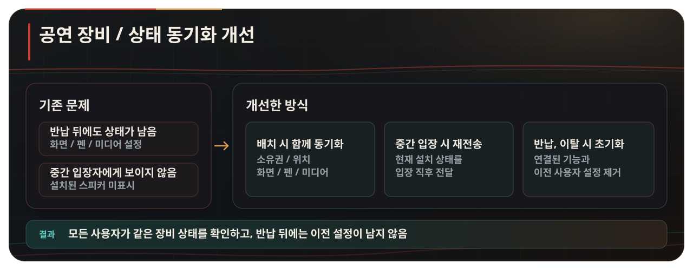
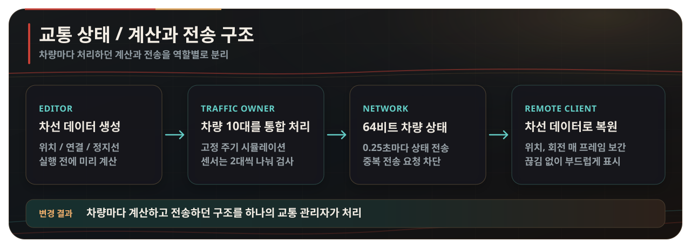

  <strong>한국어</strong> · <a href="./README.en.md">English</a> · <a href="./README.ja.md">日本語</a>

  
  <h1>Shinjuku Live Street</h1>

  <strong>신주쿠의 밤거리에서 누구나 공연을 시작하고, 지나가던 사람이 자연스럽게 관객이 되는 VRChat 소셜 월드</strong>

  <a href="https://vrchat.com/home/world/wrld_c82a5c14-97a5-4782-a034-d897d2d943a2/info"><strong>VRChat에서 월드 열기 ↗</strong></a>

---

## 월드 정보

<table align="center">
  <tr>
    <td width="180" align="center"> <strong>1,693,697회</strong> 누적 방문</td>
    <td width="180" align="center"> <strong>64,453명</strong> 즐겨찾기</td>
    <td width="180" align="center"> <strong>최대 80명</strong> 수용 인원</td>
  </tr>
</table>

VRChat 소셜 월드 · Unity / UdonSharp · 2인 제작

방문·즐겨찾기 수치 · 2026년 9월 3일 기준

## 거리 공연과 커뮤니티

<table width="100%">
  <tr>
    <td width="50%" valign="top"><strong>원하는 곳에서 시작하는 공연</strong> 보컬과 악기 연주부터 밴드 공연까지, 거리 곳곳을 무대로 활용</td>
    <td width="50%" valign="top"><strong>지나가던 사람도 관객으로</strong> 우연히 발견한 공연 앞에 멈춰 함께 듣고 즐기는 경험</td>
  </tr>
</table>

  <a href="https://x.com/search?q=%23VRSJK&src=typed_query&f=live"><strong>#VRSJK에서 실제 공연과 방문 기록 보기 ↗</strong></a>

  

---

  
  

---

## 최근 개발과 개선

2026년 9월 3일 기준

공연 장비 동기화와 교통 시뮬레이션을 다시 설계했습니다. 여러 사용자가 동시에 접속한 상황에서 장비 상태를 안정적으로 동기화하고, 반복되던 CPU·물리·GC 부하를 줄였습니다.

### 공연 장비 동기화 — 배치부터 반납까지 상태를 일관되게 관리

스피커를 반납하거나 사용자가 자리를 떠난 뒤 일부 기능의 상태가 남고, 중간 입장자에게 이미 설치된 스피커가 보이지 않는 문제가 있었습니다.

  

모든 사용자가 같은 장비 상태를 확인할 수 있고, 반납한 장비에는 이전 사용자의 설정이 남지 않도록 했습니다.

### 교통 시뮬레이션 — 차량별 반복 계산을 중앙 처리로 통합

차량마다 매 프레임 목적지 계산, `BoxCast`, Transform 이동과 직렬화를 실행해 차량과 사용자가 늘수록 CPU·물리·GC 부하가 함께 증가했습니다.

  

교통 소유자가 차량 10대의 주행 상태를 한 곳에서 계산하고, 차량 상태는 64비트로 압축해 전송합니다. 원격 클라이언트는 같은 차선 데이터에서 차량을 복원하고 매 프레임 보간해 끊김을 줄였습니다.

<strong>실행 중 디버그 화면 보기</strong>

  
   
  차선 데이터와 차량별 점유 영역·예상 위치·장애물 센서 범위

### 성능 개선 결과

차량 10대와 ClientSim으로 재현한 원격 플레이어 80명을 같은 지점에 배치하고, 초기·최신 상태를 각각 300프레임 측정했습니다. 평균 CPU 프레임 시간은 `17.65 ms → 11.92 ms`, P95 프레임 시간은 `24.60 ms → 17.44 ms`로 감소했습니다. 물리 처리 시간은 65.3%, 프레임당 GC 할당은 88.1% 줄었습니다.

차량 위치와 회전은 매 프레임 보간해 계산 사이에서도 움직임이 끊기지 않도록 했습니다.

[측정 조건과 문제별 적용 내용을 자세히 보기](./Docs/optimization.md)

## 모델과 렌더링 최적화

  
   
  왼쪽: 기본 렌더링 · 오른쪽: 동일 카메라에서 촬영한 와이어프레임

환경 모델은 구역별로 나누고, 카메라에 보이지 않는 구역은 오클루전 컬링으로 렌더링에서 제외했습니다. 고정 오브젝트는 정적 배칭으로 묶었으며, 거리와 건물 조명은 베이크했습니다.

<table align="center">
  <tr>
    <td width="260" align="center"><strong>모델 구성</strong> 삼각형 246,921개 · 환경 메시 240개</td>
    <td width="260" align="center"><strong>렌더링 최적화</strong> 정적 배칭 대상 392개 · 오클루더 설정 330개</td>
    <td width="260" align="center"><strong>충돌 처리</strong> 메시 콜라이더 2개</td>
  </tr>
</table>

베이크 조명은 약 220개 메시에 적용했습니다. 라이트맵은 4096×4096 해상도 3장과 512×512 해상도 1장을 사용했습니다.

## 코드 구성

| 영역 | 주요 파일 | 역할 |
| --- | --- | --- |
| 공연 장비 | [`SpeakerManager.cs`](./Assets/Shinjuku%20Udon/Speaker/v2.7/SpeakerManager.cs), [`SpeakerController.cs`](./Assets/Shinjuku%20Udon/Speaker/v2.7/SpeakerController.cs) | 스피커 배치, 검증, 소유권, 중간 입장자 동기화와 초기화 |
| 무대 음성 | [`VoiceRange.cs`](./Assets/Shinjuku%20Udon/Speaker/VoiceRange.cs) | 공연자의 음성 거리와 음량 공유 |
| 공유 상호작용 | [`ObjectGlobalToggle.cs`](./Assets/Shinjuku%20Udon/ObjectToggle/ObjectGlobalToggle.cs), [`ObjectLocalToggle.cs`](./Assets/Shinjuku%20Udon/ObjectToggle/ObjectLocalToggle.cs) | 전역 상태와 개인 상태 분리 |
| 교통 실행 | [`TrafficSimulationManager.cs`](./Assets/Shinjuku%20Udon/Traffic/TrafficSimulationManager.cs) | 차량 계산, 상태 압축, 전송과 원격 차량 복원 |
| 차선 데이터 | [`TrafficLaneDatabase.cs`](./Assets/Shinjuku%20Udon/Traffic/TrafficLaneDatabase.cs) | 베이크된 차선 정보 조회와 차량 자세 복원 |
| 제작 도구 | [`TrafficLaneBakerEditor.cs`](./Assets/Shinjuku%20Udon/Traffic/Editor/TrafficLaneBakerEditor.cs), [`TrafficSimulationManagerEditor.cs`](./Assets/Shinjuku%20Udon/Traffic/Editor/TrafficSimulationManagerEditor.cs) | 차선 베이킹, 설정 검사와 시각화 |
| 월드 기능 | [`PosterSlide.cs`](./Assets/Shinjuku%20Udon/Posters/PosterSlide.cs), [`PortalToggle.cs`](./Assets/Shinjuku%20Udon/Portal/PortalToggle.cs), [`CollisionTeleport.cs`](./Assets/Shinjuku%20Udon/Teleport/CollisionTeleport.cs) | 포스터 전환, 포털과 이동 처리 |

## 저장소 안내

이 저장소만으로 월드를 실행할 수는 없습니다. 직접 작성한 C#·UdonSharp 코드와 문서만 공개하며, Unity 씬과 프리팹, 모델, 이미지, 음원, 영상, 머티리얼, 애니메이션, 셰이더, `.meta` 파일은 포함하지 않습니다.

<strong>사용한 SDK·패키지·외부 구성요소</strong>

### 개발 환경

- Unity `2022.3.22f1`
- VRChat SDK - Worlds `3.8.1`
- UdonSharp
- TextMesh Pro

### 월드에서 사용한 외부 구성요소

- Topaz Chat `0.1.6`
- lilToon `1.10.3`
- VRWorldToolkit `3.2.1`
- AVPro Video
- Bakery GPU Lightmapper
- QvPen
- IwaSync3 / HoshinoLabs
- Media Manager
- Mochie Shaders
- EasyTextures
- VRC Players Only Mirror
- VRC Music Event Calendar
- Year Progress Bar
- imagePad
- Lura's Switch (Udon)
- Prototype Collection
- AllSkyFree
- Noriben Lunch shader assets
- Atelier Rayrell, RIONESTA, Zelkova Tree 및 기타 모델·환경 리소스

외부 구성요소는 이 저장소에 포함하지 않습니다. 각 항목의 저작권과 라이선스는 원 저작자 및 배포처의 정책을 따릅니다.

## 저작권

이 저장소의 자체 작성 코드에는 별도의 오픈 소스 라이선스를 부여하지 않았습니다. 별도 허가 없이 코드를 사용·수정·재배포할 수 없습니다. 외부 구성요소와 월드에 사용된 에셋의 권리는 각 원 저작자에게 있습니다.

## 팀

| 구성원 | 담당 |
| --- | --- |
| [Artistoid](https://github.com/Artistoid) · [X @Artistoid_VRC](https://x.com/Artistoid_VRC) | 기획 · 그래픽 · 3D 모델링 |
| [hjcud](https://github.com/hjcud) | Unity·UdonSharp 시스템 개발 및 최적화 |
