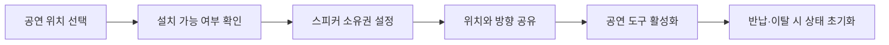
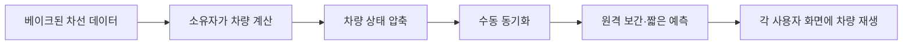

  <strong>한국어</strong> · <a href="./README.en.md">English</a> · <a href="./README.ja.md">日本語</a>

  

<h1 align="center">신주쿠 라이브 스트리트</h1>

  <strong>신주쿠의 밤거리에서 누구나 공연을 시작하고, 누구나 관객이 되는 VRChat 월드</strong>

  노래와 연주를 들려주고 싶은 사람, 우연히 발걸음을 멈춘 사람, 친구와 밤거리를 걷고 싶은 사람이 한 공간에서 만납니다.

  <a href="https://vrchat.com/home/world/wrld_c82a5c14-97a5-4782-a034-d897d2d943a2/info"><strong>VRChat에서 방문하기</strong></a>
  ·
  <a href="https://x.com/search?q=%23VRSJK&src=typed_query&f=live"><strong>#VRSJK 둘러보기</strong></a>
  ·
  <a href="#코드-구성"><strong>코드 살펴보기</strong></a>

---

## 어떤 월드인가요?

신주쿠 라이브 스트리트는 신주쿠의 밤을 채우는 네온과 소리, 끊임없이 오가는 사람들을 VRChat 안에 옮긴 **거리 공연 중심의 소셜 월드**입니다.

정해진 무대를 바라보기만 하는 공연장이 아닙니다. 사용자가 직접 자리를 정해 노래하거나 악기를 연주할 수 있고, 지나가던 사람은 그대로 관객이 됩니다. 공연이 끝난 뒤에는 서로 이야기를 나누고 단체사진을 찍으며 그날의 순간을 함께 남깁니다.

| 공개일 | 플랫폼 | 수용 인원 | 담당 영역 |
| --- | --- | ---: | --- |
| 2025년 4월 4일 | VRChat | 최대 80명 | Unity·UdonSharp 월드 시스템 |

## 이곳에서 벌어지는 일

`#VRSJK`에 올라온 사용자 기록을 살펴보면 이 월드는 하나의 정해진 방식보다 여러 사람의 선택으로 완성됩니다.

| 공연하는 사람 | 함께 듣는 사람 | 공연 뒤에 남는 것 |
| --- | --- | --- |
| 혼자 노래하거나 악기를 연주하고, 때로는 밴드가 거리 전체를 무대로 사용합니다. | 처음 만난 연주 앞에 멈춰 서서 조용히 듣거나, 춤추고 응원하며 공연에 참여합니다. | 연주자와 관객이 대화를 나누고 단체사진을 찍으며, 그날의 장면을 `#VRSJK`로 공유합니다. |

공연을 보기 위해 찾아오는 사람도 있지만, 친구를 따라 들어왔다가 모르는 사람의 노래 앞에 머무는 사람도 있습니다. 이 우연한 만남이 신주쿠 라이브 스트리트가 지향하는 경험입니다.

> 사용자들이 남긴 실제 공연과 방문 기록은 [X의 #VRSJK 검색 결과](https://x.com/search?q=%23VRSJK&src=typed_query&f=live)에서 볼 수 있습니다.

## 제가 맡은 일

사람들이 부담 없이 공연을 시작하고 같은 순간을 함께 즐길 수 있도록, 월드의 핵심 상호작용과 네트워크 시스템을 만들었습니다.

### 공연을 시작하는 도구

- 데스크톱과 VR 입력을 구분해 이동식 스피커를 배치하도록 구현했습니다.
- 설치 위치를 홀로그램으로 미리 보여주고, 경사와 거리, 사용 가능한 수량을 검사합니다.
- 스피커 소유권과 위치를 동기화하고, 나중에 들어온 사용자에게도 현재 배치 상태를 전달합니다.
- 공연자가 자리를 떠나거나 스피커를 반납하면 음량, 화면, 그림 도구와 미디어 상태를 함께 초기화합니다.

### 같은 공간을 함께 쓰는 상호작용

- 공연 중인 사용자의 음성 거리와 음량을 조정해 관객에게 전달합니다.
- 화면, 그림 도구, 거울처럼 모두가 공유해야 하는 상태와 개인에게만 필요한 상태를 분리했습니다.
- 포스터 전환, 포털, 순간이동, 오브젝트 복구처럼 월드 이용에 필요한 작은 기능을 각각 독립된 UdonSharp 컴포넌트로 구성했습니다.

## 살아 있는 거리를 만드는 교통

교통은 이 월드의 주제가 아니라 **사람이 머무는 공간 뒤에서 계속 움직이는 배경**입니다. 차량이 신호를 읽고 앞차와 간격을 맞추며 흐르도록 만들어, 공연 중에도 도시가 멈춰 있는 세트처럼 보이지 않게 했습니다.

여러 사용자가 각자 차량을 계산하면 결과가 달라지고, 모든 차량의 위치와 회전을 계속 보내면 전송량이 커집니다. 그래서 한 사용자가 차량을 계산하고, 다른 사용자는 압축된 상태를 받아 같은 차선 데이터 위에서 움직임을 재생하도록 구성했습니다.

| 항목 | 구현 방식 |
| --- | --- |
| 차량 계산 | 0.1초 고정 간격, 프레임당 계산 횟수 제한 |
| 상태 전송 | 최대 16대의 차선·진행 거리·속도 등을 차량별 64비트에 압축 |
| 원격 재생 | 패킷 도착 간격과 지터에 맞춘 보간, 최대 0.15초의 짧은 예측 |
| 소유권 변경 | 세대 번호와 패킷 순서를 비교해 오래된 상태를 버리고 마지막 상태부터 이어서 계산 |
| 물리 검사 | 소유자만 수행하고 차량을 나누어 갱신해 프레임 부하 분산 |

## 제작 과정도 도구로 만들었습니다

차선을 손으로 배열에 입력하거나 실행할 때마다 문제를 찾는 방식은 월드 규모가 커질수록 유지하기 어렵습니다. 그래서 Unity Scene에 배치된 차선을 런타임 데이터로 변환하는 베이커와, 차량·센서·네트워크 상태를 Scene View에서 확인하는 디버그 도구를 함께 만들었습니다.

- 차선 샘플과 연결 관계 자동 생성
- 끊어진 연결과 잘못된 설정 검사
- 차량 상태, 센서 범위, 목표 차선 시각화
- 여러 플레이어 상황을 가정한 스트레스 테스트

## 코드 구성

| 영역 | 주요 파일 | 역할 |
| --- | --- | --- |
| 공연 장비 | [`SpeakerManager.cs`](./Assets/Shinjuku%20Udon/Speaker/v2.7/SpeakerManager.cs), [`SpeakerController.cs`](./Assets/Shinjuku%20Udon/Speaker/v2.7/SpeakerController.cs) | 스피커 배치, 검증, 소유권, 참가자 동기화와 초기화 |
| 무대 음성 | [`VoiceRange.cs`](./Assets/Shinjuku%20Udon/Speaker/VoiceRange.cs) | 공연자의 음성 거리와 음량 공유 |
| 공유 상호작용 | [`ObjectGlobalToggle.cs`](./Assets/Shinjuku%20Udon/ObjectToggle/ObjectGlobalToggle.cs), [`ObjectLocalToggle.cs`](./Assets/Shinjuku%20Udon/ObjectToggle/ObjectLocalToggle.cs) | 전역 상태와 개인 상태 분리 |
| 교통 실행 | [`TrafficSimulationManager.cs`](./Assets/Shinjuku%20Udon/Traffic/TrafficSimulationManager.cs) | 차량 계산, 상태 압축, 전송과 원격 재생 |
| 차선 데이터 | [`TrafficLaneDatabase.cs`](./Assets/Shinjuku%20Udon/Traffic/TrafficLaneDatabase.cs) | 베이크된 차선 정보 조회와 차량 자세 복원 |
| 제작 도구 | [`TrafficLaneBakerEditor.cs`](./Assets/Shinjuku%20Udon/Traffic/Editor/TrafficLaneBakerEditor.cs), [`TrafficSimulationManagerEditor.cs`](./Assets/Shinjuku%20Udon/Traffic/Editor/TrafficSimulationManagerEditor.cs) | 차선 베이킹, 설정 검사와 시각화 |
| 월드 기능 | [`PosterSlide.cs`](./Assets/Shinjuku%20Udon/Posters/PosterSlide.cs), [`PortalToggle.cs`](./Assets/Shinjuku%20Udon/Portal/PortalToggle.cs), [`CollisionTeleport.cs`](./Assets/Shinjuku%20Udon/Teleport/CollisionTeleport.cs) | 포스터 전환, 포털과 이동 처리 |

## 저장소 안내

이 저장소만으로 월드를 실행할 수는 없습니다. 직접 작성한 C#·UdonSharp 코드와 문서만 공개하며, Unity 씬과 프리팹, 모델, 이미지, 음원, 영상, 머티리얼, 애니메이션, 셰이더, `.meta` 파일은 포함하지 않습니다.

<strong>사용한 SDK·패키지·외부 구성요소</strong>

### 개발 환경

- Unity `2022.3.22f1`
- VRChat SDK - Worlds `3.8.1`
- UdonSharp
- TextMesh Pro

### 월드에서 사용한 외부 구성요소

- Topaz Chat `0.1.6`
- lilToon `1.10.3`
- VRWorldToolkit `3.2.1`
- AVPro Video
- Bakery GPU Lightmapper
- QvPen
- IwaSync3 / HoshinoLabs
- Media Manager
- Mochie Shaders
- EasyTextures
- VRC Players Only Mirror
- VRC Music Event Calendar
- Year Progress Bar
- imagePad
- Lura's Switch (Udon)
- Prototype Collection
- AllSkyFree
- Noriben Lunch shader assets
- Atelier Rayrell, RIONESTA, Zelkova Tree 및 기타 모델·환경 리소스

외부 구성요소는 이 저장소에 포함하지 않습니다. 각 항목의 저작권과 라이선스는 원 저작자 및 배포처의 정책을 따릅니다.

## 저작권

이 저장소의 자체 작성 코드에는 별도의 오픈 소스 라이선스를 부여하지 않았습니다. 별도 허가 없이 코드를 사용·수정·재배포할 수 없습니다. 외부 구성요소와 월드에 사용된 에셋의 권리는 각 원 저작자에게 있습니다.

---

  <a href="https://vrchat.com/home/world/wrld_c82a5c14-97a5-4782-a034-d897d2d943a2/info">VRChat 월드</a>
  ·
  <a href="https://x.com/search?q=%23VRSJK&src=typed_query&f=live">#VRSJK</a>
  ·
  <a href="https://github.com/hjcud/Shinjuku-Live-Street">GitHub</a>

